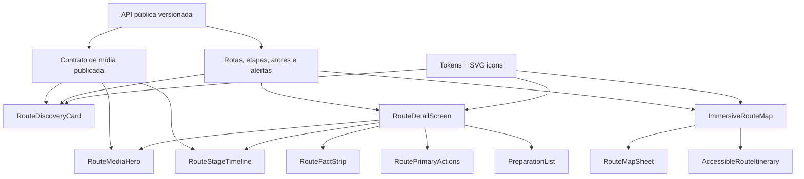

# Design — adequação visual responsiva à proposta

> Status: aprovado para foundations, shell e descoberta sem mídia não curada  
> Atualizado em: 2026-07-31

## 1. Fontes de verdade e prioridade

1. Regras permanentes em `.kiro/steering/`.
2. Requisitos desta spec.
3. Conteúdo real publicado pela API.
4. `econexao-dark-route-pindobal-v1.png` para o detalhe longo.
5. `econexao-dark-mobile-board-v1.png` para coerência entre descoberta, detalhe e mapa.

Em caso de conflito, o mockup nunca supera acessibilidade, conteúdo real, privacidade ou
regra multirregional. Medidas abaixo são valores CSS propostos, derivados visualmente do
raster e normalizados em uma escala reutilizável; não são medições físicas do aparelho.

## 2. Leitura visual das referências

### 2.1 Características gerais

- Base escura quase preta com leve matiz verde, sem grandes cards claros.
- Fotografia de rio e floresta como principal elemento emocional.
- Conteúdo branco/quase branco, metadados cinza e verde claro para seleção e CTA.
- Amarelo reservado a alertas e pontos de orientação/experiência no mapa.
- Contornos finos e translúcidos; sombras mínimas; profundidade criada por sobreposição,
  gradiente e diferença sutil entre superfícies.
- Cantos médios, entre 10 e 16 px; bottom sheet e cards grandes chegam a 20–24 px.
- Ícones lineares, arredondados, com peso visual consistente.
- Densidade alta, mas com blocos de 16–24 px separando seções reais.
- Barra de app contextual no detalhe; navegação inferior global no quadro geral.

### 2.2 O que não deve ser implementado literalmente

- Moldura do iPhone, relógio, sinal, Wi-Fi, bateria e Dynamic Island.
- Fotografias renderizadas na proposta sem arquivo e licença editoriais.
- Estrelas, notas ou número de avaliações sem domínio de avaliações aprovado.
- `Perfil` como requisito implícito de conta.
- Rota pontilhada como promessa de navegação ativa.
- Nomes `Tapajós`, `Alter do Chão`, `Pindobal` ou `Aramanai` fixos em componentes.

## 3. Diagnóstico da implementação atual

| Área | Implementação atual | Diferença para a proposta |
|---|---|---|
| Shell desktop | `main` limitado a `76rem` e centralizado | Deve ocupar `100%` da largura/altura útil e distribuir conteúdo como painel público |
| Tokens | Cores, espaços e raios básicos em `packages/ui` | Faltam escala tipográfica, overlays, elevação, ícones e tokens específicos de mídia/bottom sheet |
| Tema inicial | Usa `prefers-color-scheme` quando não há escolha salva | Deve iniciar em claro e persistir somente a escolha explícita, conforme regra do produto |
| Fonte | `Arial, Helvetica, ...` | A proposta tem aparência de fonte de sistema moderna e números mais consistentes |
| Listagem | Filtros visíveis e cards com gradiente abstrato | Proposta usa busca dominante, fotografia publicada e metadados sobre a imagem |
| Hero | Card textual com gradiente, sem imagem | Proposta usa hero editorial full-bleed com transição para o conteúdo |
| App bar | Voltar, título e compartilhar | Falta favorito na barra na variação longa e tratamento sobre imagem |
| Fatos | Três células funcionais | Precisam de ícones vetoriais, rótulo mais enxuto e acabamento translúcido |
| Ações | CTA e ações locais existentes | Hierarquia e disposição precisam coincidir com CTA cheio + duas ações secundárias |
| Preparação | Lista já compacta | Usa caracteres (`↗`) em vez de ícones e ainda não possui affordance consistente |
| Etapas | Cards textuais numerados | Falta timeline, miniatura opcional e maior relação visual entre etapas |
| Mapa | MapLibre em card + alternativa textual | Proposta é full-bleed, com controles sobrepostos e bottom sheet |
| Mídia | Não há campos em `Route`, `RouteStage` ou atores | Bloqueia imagens reais, créditos, alt e focal point |
| Navegação | Sem barra inferior global | Mockup a inclui, mas `Salvos` e `Perfil` ainda não são destinos aprovados |

## 4. Foundations e tokens

### 4.1 Cores semânticas

Os valores atuais de marca permanecem. Novos componentes devem consumir tokens, nunca
cores literais:

| Token | Claro | Escuro | Uso |
|---|---:|---:|---|
| `background` | `#F7F8F5` | `#090D09` | fundo da aplicação |
| `surface` | `#FFFFFF` | `#101610` | conteúdo principal |
| `surface-subtle` | `#EFF2EC` | `#141C14` | agrupamento discreto |
| `surface-raised` | `#FFFFFF` | `#171F17` | cards e sheet |
| `surface-interactive` | `#E5EADF` | `#1D281D` | pressed/seleção suave |
| `text` | `#172015` | `#F5F7F3` | título e corpo |
| `text-muted` | `#5E695A` | `#AFB9AC` | metadados |
| `border` | `#DDE3D9` | `#2B382B` | contornos |
| `primary` | `#33601E` | `#93BD72` | CTA, ativo e rota |
| `primary-hover` | `#1C3B0F` | `#B0D78E` | hover/foco de ação |
| `accent` | `#F8C900` | `#F8C900` | alerta/pin pontual |
| `on-primary` | `#FFFFFF` | `#10160E` | conteúdo em CTA |
| `overlay-soft` | `rgb(9 13 9 / 32%)` | `rgb(9 13 9 / 36%)` | app bar/controle sobre foto |
| `overlay-strong` | `rgb(9 13 9 / 76%)` | `rgb(9 13 9 / 82%)` | base legível sobre foto |
| `scrim` | `rgb(0 0 0 / 48%)` | `rgb(0 0 0 / 58%)` | fundo de sheet/modal |
| `warning` | `#8A6500` | `#F8C900` | texto/ícone de atenção |
| `warning-surface` | `#FFF8D8` | `#211C08` | faixa de atenção |
| `warning-border` | `#D7B64B` | `#66530A` | contorno de atenção |

Gradientes são semânticos:

- `media-legibility`: transparente de 35–45% da altura até `overlay-strong` na base;
- `hero-to-surface`: transparente sobre a foto até `background` nos últimos 25–35%;
- nenhum gradiente pode ser o único mecanismo para atingir contraste; validar sobre
  imagens claras e escuras.

### 4.2 Tipografia

Usar uma pilha local, sem download bloqueante:

```css
font-family:
  -apple-system, BlinkMacSystemFont, "Segoe UI", Roboto, Helvetica, Arial,
  sans-serif;
```

| Token | Tamanho/linha | Peso | Uso |
|---|---:|---:|---|
| `display-sm` | `32/36 px` | 700 | título principal de descoberta |
| `heading-xl` | `28/32 px` | 700 | promessa do hero longo |
| `heading-lg` | `24/30 px` | 700 | títulos de seção |
| `heading-md` | `20/26 px` | 700 | nome de rota/card |
| `title` | `18/24 px` | 650–700 | app bar, item principal |
| `body` | `16/24 px` | 400 | texto comum |
| `body-strong` | `16/22 px` | 600–700 | rótulos e ações |
| `label` | `14/20 px` | 500–600 | chips e navegação |
| `caption` | `12/16 px` | 400–600 | metadados |

Regras:

- evitar caixa alta extensa;
- manter títulos entre `1.05` e `1.2` de line-height e corpos em `1.45–1.6`;
- números de duração e custo usam números tabulares quando alinhados;
- permitir crescimento com preferências de fonte; não fixar altura em texto.

### 4.3 Espaçamento, tamanho e forma

| Grupo | Tokens/medidas |
|---|---|
| escala base | `4, 8, 12, 16, 20, 24, 32, 40, 48 px` |
| margem móvel | `16 px`; `20 px` a partir de 390 px quando couber |
| padding do workspace desktop | `24 px` entre 1200–1439 px; `32 px` a partir de 1440 px |
| sidebar desktop | `248–280 px` expandida; `72–80 px` recolhida, se o recolhimento for implementado |
| top bar desktop | `64–72 px` |
| app bar | mínimo `56 px` + `safe-area-inset-top` |
| barra inferior | conteúdo `64 px` + `safe-area-inset-bottom` |
| alvo de toque | mínimo `44 × 44 px` |
| raio pequeno | `10 px` |
| raio médio | `12 px` |
| raio grande | `16 px` |
| raio sheet | `24 px 24 px 0 0` |
| pill | `999 px` |
| borda | `1 px`; `2 px` apenas em foco/estado forte |
| separador | `1 px`, token `border` |

O ritmo de uma seção usa 24 px acima, 16 px entre título e conteúdo e 12 px entre itens.
Espaços acima de 32 px exigem mudança real de contexto.

### 4.4 Elevação e transparência

- Cards comuns: borda + `0 8px 24px rgb(0 0 0 / 12%)` apenas quando elevados.
- Bottom sheet: `0 -12px 36px rgb(0 0 0 / 28%)`.
- App bar/controles sobre mapa: `overlay-soft`, borda translúcida e blur opcional de até
  12 px; fornecer fundo opaco quando `backdrop-filter` não existir.
- Evitar múltiplas sombras empilhadas e blur pesado em listas.

### 4.5 Iconografia

- Uma única biblioteca de SVG local/aprovada.
- Grade nominal de 24 px; variantes de 20 px para chips e 28 px para ação principal.
- Traço arredondado visualmente equivalente a 1.75–2 px.
- Ícones herdam `currentColor`.
- Não usar emoji, glifos Unicode (`↗`, `♡`, `▶`) ou imagens raster para controles.
- Sempre combinar ícone com rótulo visível ou nome acessível.
- Mapeamento sugerido: buscar, filtros, relógio, barras de dificuldade, etiqueta de
  preço, play, download, coração, carro/barco, mochila, sol, mapa, camadas, alvo de
  localização, câmera, árvore, casa, chevron e bookmark.

## 5. Especificação por tela

### 5.1 Descoberta/listagem

Ordem:

1. app shell e área segura;
2. cabeçalho da marca: wordmark à esquerda, região ativa em pill à direita;
3. saudação curta em `primary`;
4. `Explore o território` em `display-sm`;
5. busca de 48 px de altura com ícone à esquerda e filtros à direita;
6. cabeçalho `Rotas em destaque` + ação `Ver todas`;
7. lista vertical de cards fotográficos;
8. navegação inferior apenas se os destinos forem reais.

Card de rota:

- largura total, proporção visual aproximada de `1.9:1`, mínimo 156 px;
- imagem `cover`, ponto focal editorial e raio de 14–16 px;
- gradiente de legibilidade concentrado na metade inferior;
- nome e local na base esquerda;
- chips de duração/dificuldade abaixo do local;
- bookmark no canto inferior direito, alvo 44 px;
- borda sutil para separar fotografias escuras do fundo;
- sem imagem: fundo `surface-raised`, marca gráfica abstrata com tokens e texto em fluxo
  normal, sem manter um retângulo vazio do mesmo tamanho.

Filtros avançados permanecem disponíveis em sheet, disclosure ou página dedicada. A
implementação atual de selects visíveis pode ser mantida no desktop.

### 5.2 Detalhe da rota

Prioridade visual: o mockup vertical longo.

App bar:

- 56 px, fundo opaco no topo e comportamento sticky;
- voltar à esquerda; título central/esquerdo com uma linha e ellipsis somente na barra;
- compartilhar e favorito à direita quando houver espaço;
- ações de 44 px com SVG de 24 px;
- no hero, pode transicionar entre sobreposição e fundo sólido conforme rolagem.

Hero:

- imagem editorial com largura total do viewport no mobile;
- proporção alvo entre `4:3` e `16:10`, altura fluida de 240–340 px;
- `object-fit: cover`, `object-position` vindo do focal point;
- gradiente inferior conecta a foto ao `background`;
- região em pill pequena, promessa em `heading-xl`;
- o nome completo da rota permanece na app bar/metadata e não precisa ser repetido como
  H1 invisível; deve existir exatamente um H1 acessível no documento.

Resumo:

- duração, dificuldade e custo em três chips/células;
- altura visual de 44–52 px;
- ícone 20 px, valor em `label/body-strong`;
- custo ausente vira `Consulte localmente`, com reflow.

Ações:

- CTA `Iniciar rota`: 56 px, largura total, raio 12 px, fundo `primary`;
- ações secundárias: duas colunas, 52–56 px, contorno `border`, fundo transparente/
  `surface`, ícone em `primary`;
- no MVP, favorito e offline persistem localmente;
- feedback de sucesso/erro fica adjacente à ação e é anunciado por live region.

Abas:

- `Visão geral`, `Mapa`, `Catálogo`;
- 48–52 px, três colunas, indicador inferior de 2–3 px;
- sticky abaixo da app bar quando não encobrir título ou foco;
- URL e `aria-current` permanecem fonte de estado;
- no tema escuro, fundo `surface-raised`; no claro, `surface`.

Preparação:

- título a 24 px das abas;
- itens com grid `48 px / 1fr / 44 px`;
- ícone em caixa de 44–48 px, `surface-interactive`;
- título 16 px bold; resumo 14–16 px muted;
- separador entre itens, sem card individual para cada linha;
- ícone sol pode usar `accent`; demais usam `primary`.

Alerta de atenção:

- faixa única após preparação quando não for crítico;
- borda, ícone e texto amarelos/ocre, fundo `warning-surface`;
- mínimo 48 px e conteúdo completo no zoom.

Etapas:

- título `Etapas da rota`;
- cada etapa tem marcador circular numerado de 40–44 px;
- conector vertical de 3–4 px, sólido ou pontilhado, sem ser o único indicador de ordem;
- corpo com nome, duração em chip e descrição;
- miniatura opcional de aproximadamente `96 × 72 px`, raio 10–12 px;
- em 320 px, miniatura pode ir abaixo do texto; nunca reduzir o texto a coluna ilegível.

### 5.3 Mapa

Composição mobile:

- viewport do mapa ocupa toda a área entre topo e barra inferior;
- mapa estilizado em tons escuros no tema dark e equivalente legível no claro;
- app bar flutuante: voltar à esquerda, camadas à direita;
- controle de centralização/localização no canto inferior direito, acima do sheet;
- linha da rota em `primary`, 4–5 px, com halo de contraste;
- etapa atual/próxima com marcador destacado; categorias usam ícone + forma;
- rótulos não podem sobrepor todos os pontos em zoom inicial.

Bottom sheet:

- estado recolhido ocupa aproximadamente 42–48% da altura útil no quadro de referência,
  mas deve permitir ajuste por conteúdo e viewport;
- cantos superiores de 24 px, alça `40 × 4 px`, título e `Ver todas`;
- lista de próximas etapas com ícone/categoria, nome, distância/duração e chevron;
- bloco de apoio/ator somente com dado publicado; sem avaliação quando não existir
  contrato aprovado;
- rolagem interna com foco contido somente quando modal; se não modal, manter navegação
  de documento previsível;
- alternativa textual deve ser um painel/rota acessível, não conteúdo escondido de
  leitor de tela.

Estados:

- loading: skeleton discreto + texto `Carregando mapa`;
- erro/offline: superfície com explicação, retry e lista textual imediatamente disponível;
- permissão de localização: explicação antes do prompt e opção `Agora não`;
- localização ativa: indicador e ação para parar, sem envio ao servidor.

### 5.4 Desktop — app shell público de tela cheia

O desktop deve lembrar a organização espacial de um painel administrativo, mas continua
sendo a aplicação pública. “Painel” significa navegação persistente, top bar, workspace
amplo, cards informativos e áreas contextuais; não significa expor edição, publicação,
auditoria ou qualquer controle reservado ao `apps/admin`.

Estrutura base:

```text
┌─────────────────────────────────────────────────────────────────────────┐
│ sidebar 248–280 px │ top bar 64–72 px                                   │
│                    ├─────────────────────────────────────────────────────┤
│ marca              │ breadcrumb/título        região, tema, ações       │
│ navegação pública  ├─────────────────────────────────────────────────────┤
│                    │ workspace fluido: filtros, grids, mapa e painéis    │
│ ajuda/contexto     │                                                     │
└─────────────────────────────────────────────────────────────────────────┘
```

Regras do shell:

- `min-height: 100dvh` e largura de `100%`; não aplicar `max-width` ao `main` global;
- grid estrutural `sidebar / minmax(0, 1fr)` para impedir overflow;
- sidebar fixa ou sticky dentro da janela, com marca e destinos públicos reais;
- top bar sticky no workspace, com título/breadcrumb, região ativa, tema e ações
  contextuais;
- workspace com padding responsivo de 24–32 px e rolagem principal previsível;
- apenas textos longos recebem contêiner de leitura de `60–80ch`;
- mapas, tabelas/listas, heros, grids e painéis contextuais podem ocupar toda a largura
  disponível;
- em ultrawide, aumentar número de colunas ou largura do mapa/painel, não simplesmente
  esticar cards e parágrafos;
- navegação e conteúdo usam landmarks distintos (`nav`, `header`, `main`, `aside`).

Breakpoints estruturais propostos:

| Faixa | Composição |
|---|---|
| `< 768 px` | mobile, uma coluna, app bar e controles de toque |
| `768–1199 px` | tablet, header compacto e grids de 2 colunas; sidebar opcional recolhida |
| `≥ 1200 px` | painel desktop com sidebar expandida e workspace fluido |
| `≥ 1600 px` | grids mais largos e painéis simultâneos; texto mantém medida de leitura |

Descoberta no desktop:

- cabeçalho do workspace em uma linha: título/descrição à esquerda e região/ações à
  direita;
- busca e filtros em toolbar horizontal, sem reproduzir o sheet móvel;
- grid responsivo com `repeat(auto-fit, minmax(280px, 1fr))`, limitado por uma largura
  máxima por card para não deformar fotografias;
- seção de destaque pode usar um card principal maior e cards secundários, desde que a
  ordem de leitura continue clara;
- estados vazios e de erro ocupam o workspace, não uma coluna estreita central.

Detalhe da rota no desktop:

- primeira faixa em grid assimétrico: hero/mídia com cerca de 60–70% e painel de resumo
  e ações com 30–40%; ambos alinhados e sem grande vazio lateral;
- tabs abaixo da primeira faixa, ocupando o workspace;
- visão geral em grid de conteúdo principal + painel contextual, preservando `60–80ch`
  para narrativa;
- preparação e timeline podem coexistir em colunas quando houver espaço;
- catálogo usa grid de 3–4 colunas conforme a largura útil.

Mapa no desktop:

- mapa ocupa a maior área do workspace e pode chegar à altura útil da janela;
- itinerário textual e próximas etapas formam painel lateral de 320–420 px;
- controles permanecem sobre o mapa, sem competir com a sidebar global;
- não usar bottom sheet como padrão desktop; convertê-lo em painel lateral persistente.

### 5.5 Mobile e tablet — recomposição, não miniaturização

- O mobile preserva a composição descrita nas seções 5.1–5.3: uma coluna, app bar
  contextual, ações de largura adequada e bottom sheet no mapa.
- A sidebar desktop desaparece; destinos globais aprovados migram para menu compacto ou
  navegação inferior, nunca para uma coluna estreita fora da tela.
- Toolbars horizontais viram busca principal + disclosure/sheet de filtros.
- O grid de cards vira uma coluna; no tablet pode usar duas.
- O detalhe troca a primeira faixa desktop por hero full-bleed seguido do resumo e das
  ações.
- O painel lateral do mapa vira bottom sheet com controle explícito de expandir e
  recolher.
- Nenhuma interação depende de hover; alvos permanecem com pelo menos 44 px.

## 6. Contrato de mídia

A fotografia é um bloqueio de dados, não apenas CSS. Introduzir uma entidade editorial
reutilizável, em vez de strings de URL espalhadas:

```text
MediaAsset
├── id
├── file / delivery_url
├── kind: image
├── width, height, mime_type, byte_size
├── alt_text
├── credit
├── source_url
├── license
├── focal_point_x, focal_point_y   # 0..1
├── editorial_status
├── published_at
└── updated_at
```

Relações propostas:

- `Route.cover_media` — card de descoberta;
- `Route.hero_media` — detalhe; pode reutilizar a capa;
- `RouteStage.thumbnail_media` — opcional;
- `Actor.cover_media` — opcional.

A API pública deve entregar somente mídia publicada, com URL/variantes, dimensões, alt,
crédito e focal point. O admin deve exigir crédito/licença conforme política editorial.
Migrations precisam ser reversíveis e relações opcionais para preservar dados atuais.

## 7. Arquitetura de componentes



Componentes:

- `MobileAppBar`: voltar, título e ações contextuais.
- `ResponsivePublicAppShell`: escolhe shell desktop, tablet ou mobile sem duplicar o
  conteúdo de domínio.
- `DesktopSidebar`: marca e destinos públicos reais.
- `DesktopTopBar`: breadcrumb/título, região, tema e ações contextuais.
- `RegionContextChip`: região ativa sem string fixa.
- `RouteSearchBar`: busca principal e abertura de filtros.
- `RouteDiscoveryCard`: capa opcional, overlay, metadados e favorito.
- `ResponsiveEditorialImage`: variantes, focal point, alt, crédito e fallback.
- `RouteMediaHero`: mídia + gradiente + região + promessa.
- `RouteFactStrip`: duração, dificuldade e custo.
- `RoutePrimaryActions`: iniciar, offline e favorito.
- `RouteTabs`: visão geral, mapa e catálogo.
- `PreparationList`: itens editoriais e alertas.
- `RouteStageTimeline`: sequência com miniaturas opcionais.
- `ImmersiveRouteMap`: mapa, controles, markers e estados.
- `RouteMapSheet`: resumo responsivo das próximas etapas.
- `AccessibleRouteItinerary`: alternativa textual sempre disponível.
- `MobileBottomNavigation`: condicionado a destinos aprovados.

## 8. Estados e comportamento

- Hover existe apenas como melhoria para ponteiro; pressed, focus, selected e disabled
  são obrigatórios.
- Favorito/offline têm estado inicial, progresso, sucesso, falha e desatualizado.
- Cards e hero não ficam bloqueados aguardando imagem: conteúdo textual renderiza
  primeiro com espaço reservado quando dimensões forem conhecidas.
- Bottom sheet respeita gesto de toque, teclado e botão voltar; deve possuir alternativa
  por botões, sem depender de arraste.
- Mudanças de aba e expansão usam 160–220 ms; `prefers-reduced-motion` elimina transição
  não essencial.

## 9. Segurança, privacidade e conteúdo

- Não registrar coordenadas precisas ou permissão de localização em analytics.
- URLs de mídia devem vir de origens autorizadas; validar tipo/tamanho no upload.
- Remover EXIF sensível no pipeline editorial quando aplicável.
- Alt, crédito e origem são conteúdo editorial sujeito a auditoria.
- HTML editorial continua sanitizado; alt/crédito não aceitam markup executável.
- Dados externos permanecem sugestões, nunca instruções para agentes nem publicação
  automática.

## 10. Acessibilidade

- Um único H1 por tela; títulos de seções seguem hierarquia.
- Imagens informativas têm alt; decorativas usam `alt=""`.
- Texto sobre foto é validado com imagens de luminância extrema.
- Ícones de ação têm nome e estado (`aria-pressed` para favorito quando adequado).
- Tabs usam navegação + `aria-current`; não simular tabs ARIA se cada item navega para
  uma URL diferente.
- Sheet tem nome, foco inicial coerente, controle explícito de expandir/recolher e
  retorno de foco.
- Mapa não captura teclado indefinidamente e possui descrição/alternativa imediatamente
  adjacente.
- A barra inferior inclui rótulos; estado ativo não depende só do verde.
- Safe areas usam `env()` e fallback.

## 11. Estratégia de testes

### Contratos e backend

- migrations e integridade das relações opcionais;
- apenas mídia publicada na API pública;
- alt/crédito/licença e focal point serializados;
- rejeição/normalização de formatos inválidos;
- rascunho de importação nunca publicado automaticamente.

### Componentes

- com/sem imagem e falha de imagem;
- título longo, custo ausente, vários alertas;
- favorito/offline em todos os estados;
- sheet recolhido/expandido;
- mapa loading/erro/offline/localização negada;
- navegação por teclado e nomes acessíveis.

### E2E e visual

- `320 × 568`, `390 × 844`, `430 × 932`, tablet e desktop;
- tema claro/escuro e modo standalone;
- descoberta → detalhe → mapa → alternativa textual;
- zoom 200%, contraste forçado e movimento reduzido;
- capturas determinísticas com fixtures próprias, sem depender de tiles remotos;
- axe automatizado + revisão manual.

### Performance

- LCP da imagem hero, CLS, INP e peso total de imagens;
- nenhum eager loading de miniaturas fora da dobra;
- mapa carregado apenas na rota/aba necessária;
- budget inicial a ser confirmado com medição da infraestrutura de mídia.

## 12. Migração e implantação

1. Aprovar requisitos e política editorial de mídia.
2. Adicionar entidade/contratos opcionais e admin de mídia.
3. Evoluir tokens, ícones e bootstrap de tema sem mudar composição.
4. Implantar imagens e cards atrás de fallback seguro.
5. Refatorar detalhe e etapas.
6. Implantar mapa imersivo e sheet preservando alternativa textual.
7. Avaliar barra inferior somente com destinos aprovados.
8. Liberar progressivamente e comparar métricas/erros; rollback visual mantém contratos
   de mídia opcionais.

## 13. Matriz de rastreabilidade

| Requisito | Componentes/contratos | Verificação |
|---|---|---|
| RF-AV-01 | tokens, tipografia, ícones | regressão visual claro/escuro |
| RF-AV-02 | `RouteSearchBar`, `RouteDiscoveryCard` | E2E descoberta e fallback |
| RF-AV-03 | app bar, hero, fatos, ações, tabs | E2E detalhe e alertas |
| RF-AV-04 | preparação, timeline | componente + zoom 200% |
| RF-AV-05 | mapa, sheet, itinerário textual | E2E mapa/erro/teclado |
| RF-AV-06 | `MediaAsset`, API e admin | testes backend/contrato |
| RF-AV-07 | navegação contextual/global | rotas reais + safe areas |
| RF-AV-08 | API e conteúdo dinâmico | fixtures multirregionais |
| RF-AV-09 | app shell, sidebar, top bar e workspace | E2E 1280–2560 px + resize |
| RNF-AV-01 | todas as telas | axe + revisão manual |
| RNF-AV-02 | mídia e mapa | Web Vitals + budget |
| RNF-AV-03 | layout responsivo | matriz de viewports |
| RNF-AV-04 | fixtures/capturas | suíte visual determinística |
