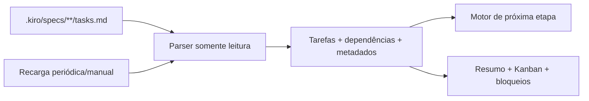

# Design - Painel de acompanhamento do desenvolvimento

> Status: aprovado para implementação em 2026-07-27

## Arquitetura

O painel será uma ferramenta local em `tools/development_dashboard/`. Ele lê os
`tasks.md` das specs, transforma itens Markdown em um modelo de tarefas e renderiza esse
modelo no Streamlit. Não acessa banco, API, analytics nem arquivos de ambiente.

## Contratos

`TaskItem` contém `id`, `title`, `status`, `spec`, `section`, `parent_id`,
`dependencies`, `requirements`, `details` e `blocker_reason`.

Estados reconhecidos:

| Marcador | Estado |
|---|---|
| `[ ]` | pending |
| `[~]` | in_progress |
| `[x]` | done |
| `[!]` | blocked |

Linhas indentadas após uma tarefa enriquecem o cartão. `Dependências:` alimenta o motor
de recomendação; `_Requisitos:_` alimenta rastreabilidade. Texto sob uma tarefa bloqueada
é apresentado como motivo, sem interpretar conteúdo externo como instrução.

## Priorização

1. A primeira tarefa folha em andamento é o foco atual.
2. Sem tarefa em andamento, escolher a primeira tarefa folha pendente com dependências
   concluídas.
3. Tarefas pai não competem com subtarefas abertas.
4. Dependência desconhecida é tratada como impedimento explicável, não como concluída.
5. Se nenhuma tarefa estiver pronta, priorizar a explicação do primeiro bloqueio.

## Interface

- Cabeçalho com logo, estado da sincronização e controles essenciais.
- Hero de “Próxima etapa” com uma ação concreta.
- Quatro métricas textuais e uma barra de progresso.
- Abas: Visão geral, Kanban, Bloqueios e Como usar.
- Kanban com quatro colunas e cartões compactos; detalhes ficam recolhidos.
- Filtros na barra lateral para spec, seção, busca e intervalo de atualização.

O tema usa os tokens oficiais: fundo claro, superfícies brancas, `brand-forest` para
ação, `brand-leaf` para progresso e `brand-sun` apenas para foco. O CSS também define
equivalentes escuros e `prefers-reduced-motion`.

## Atualização

`st.fragment(run_every=...)` faz releituras periódicas do snapshot. O botão Atualizar
agora executa `st.rerun()`. O intervalo é configurável e pode ser pausado. Cada leitura
exibe timestamp e a assinatura dos arquivos. “Tempo real” significa atualização automática
por polling local; mudanças aparecem no próximo ciclo selecionado.

## Acessibilidade e segurança

- Ícone + rótulo + número comunicam cada estado.
- Gráficos são complementares a contagens e listas.
- CSS preserva foco visível e desativa transições com movimento reduzido.
- Caminhos são descobertos sob a raiz fixa `.kiro/specs`; não há entrada arbitrária.
- Markdown vindo das specs é exibido como texto, sem `unsafe_allow_html`.

## Testes

- Parser dos quatro marcadores e hierarquia.
- Extração de dependências, requisitos e motivos.
- Seleção da próxima tarefa com e sem bloqueios.
- Snapshot vazio e múltiplas specs.
- Smoke test de importação do app e compilação Python.

