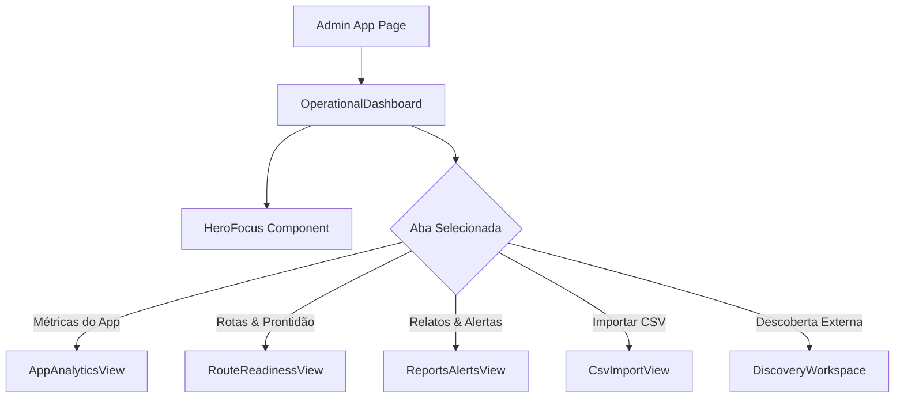

# Design - Painel Operacional Administrativo (Reflexo do App)

## Arquitetura de Componentes (`apps/admin`)

```text
apps/admin/src/app/
├── page.tsx                         # Entry point com Header e Layout
├── operational-dashboard.tsx        # Controller de estado, abas e seletor de região
├── styles.css                       # Tokens e utilitários visuais
└── components/
    ├── hero-focus.tsx               # Card de ação recomendada (Foco TDAH)
    ├── app-analytics-view.tsx       # Visão de métricas e acessos aos pontos
    ├── route-readiness-view.tsx     # Tabela de prontidão e estado editorial
    ├── reports-alerts-view.tsx      # Central de triagem de relatos da comunidade
    └── discovery-workspace.tsx      # Busca efêmera Google Places (Aba 4)
```

## Fluxo de Estado e Dados



## Integração editorial

- A edição de ponto existente usa o UUID de `actor`, o UUID da região selecionada e o endpoint de
  revisões editoriais; slug de região e identificador de vínculo `RouteActor` não substituem esses
  IDs de domínio.
- A prévia local só é atualizada depois de resposta `201` da API. Em falha, o modal permanece
  aberto, preserva os campos e mostra erro.
- A criação manual de ator novo exige contrato transacional próprio para ator, localização,
  contato e vínculo com rota. Esse contrato ainda não existe; até sua especificação e
  implementação, a inclusão de novos pontos usa a importação CSV, que já produz rascunhos.
- Requisições administrativas no navegador usam `apps/admin/src/lib/admin-api.ts` para sessão,
  CSRF e tradução uniforme de erros.

## Matriz de prontidão auditável (task 4.3)

`GET /api/v1/admin/routes/readiness?region_slug=<slug>` exige sessão, `VIEW_AGGREGATES` e escopo
regional resolvido no servidor; administrador possui escopo global. O DTO administrativo é
separado da API pública e só retorna dados operacionais da região autorizada.

O cálculo possui pesos fixos e versionados: conteúdo 30%, traçado 25%, catálogo 20%, alertas 15%
e offline 10%. Conteúdo vale 100 quando `public_name`, `short_promise`, `description`,
`duration_minutes`, `difficulty`, `transport_modes` e `preparation_content` estão presentes;
traçado vale 100 quando há pelo menos uma etapa e um segmento; catálogo vale a proporção de
pontos publicados com todos os contatos públicos verificados (ou 100 se não há ponto aplicável);
alertas vale 100 na ausência de alerta crítico publicado vigente; offline vale 100 quando
`offline_enabled`. O score é a soma ponderada, arredondada, apenas quando todas as dimensões são
observáveis; dimensão indisponível gera `score: null`, nunca zero inferido.

Bloqueadores não são pesos: campos obrigatórios ausentes, ausência de etapa, ausência de segmento,
alerta crítico vigente e contato público sem verificação impedem `is_ready`, mesmo com score alto.
Pontos em revisão, versão publicada e data da última revisão são indicadores informativos. O
endpoint retorna motivos explícitos, enum estável e sem PII; erros 401/403/429/500 permanecem
distintos no proxy e o painel mostra indisponibilidade em vez de simular dados.

Testes cobrem fórmula, bloqueadores, estados editoriais, região vazia, escopo, erros, contrato
OpenAPI real e renderização da matriz.

## Contratos do painel e especificações da task 2.3

- Endpoint administrativo de resumo operacional: `GET /api/v1/admin/dashboard/summary` (parâmetro opcional `?region_slug=<slug>`).
- Autenticação e Autorização: Requer usuário autenticado (`is_staff`) com ação administrativa (`VIEW_AGGREGATES` ou `LIST_REPORTS`). Se o usuário não for `ADMINISTRATOR`, o escopo é restrito às regiões retornadas por `get_user_region_slugs(user)`. Requisições para regiões fora do escopo retornam `403 FORBIDDEN`.
- Schema da resposta (200 OK):
  ```json
  {
    "region_slug": "alter-do-chao",
    "priority_reports_count": 2,
    "active_alerts_count": 1,
    "pending_revisions_count": 3
  }
  ```
- O payload traz apenas agregados numéricos regionais, sem dados pessoais nem coordenadas (aderente à LGPD/RNF-ADM-01).
- Mapeamento no Frontend: O cliente administrativo compartilhado `apps/admin/src/lib/admin-api.ts` consome `/api/admin/dashboard/summary?region_slug=...`. O componente `HeroFocus` recebe as contagens reais e só declara a operação estável quando `alertsCount === 0 && pendingRevisionsCount === 0`.
- Tratamento de erros no Frontend: Em caso de carregamento, falhas HTTP (401, 403, 429, 500) ou rede, `HeroFocus` mantém estado de indisponibilidade parcial ("Prioridade operacional indisponível em <região>") e permite retentativa sem cair para valores simulados.

## Analytics minimizado e ranking por ponto (task 3.3)

### Finalidade, eventos e dimensões permitidas

A finalidade é medir, apenas após consentimento opcional, uso agregado do produto e intenção de
contato; não mede pessoas, conversões ou deslocamentos. A allowlist substitui a taxonomia ampla
para a visão operacional:

| Evento | Dimensões permitidas | Métrica administrativa |
|---|---|---|
| `session_opened` | `region_slug` | sessões consentidas (aberturas, não pessoas únicas) |
| `route_opened` | `region_slug`, `route_slug` | rotas abertas |
| `contact_opened` | `region_slug`, `route_slug`, `support_point_id` UUID de ator publicado | intenções de contato e ranking |
| `offline_download_completed` | `region_slug`, `route_slug` | downloads concluídos |

Nenhum evento aceita `properties`, coordenadas, endereço, texto livre, URL, telefone, e-mail,
contato do visitante, IP, user-agent, cookie, ID de usuário, sessão, consentimento, dispositivo,
campanha ou identificador pseudônimo. `support_point_id` é resolvido no servidor, deve ser UUID de
ator publicado associado à rota/região declaradas e não é exposto como dado de visitante.

### Minimização, risco e retenção

O risco residual relevante é inferir interesse de um visitante por uma combinação rara
região/rota/ponto/período. Portanto o backend persiste somente a agregação diária mínima
`data + evento + região + rota opcional + ponto opcional + contagem`; a dimensão de ponto é
admitida somente para `contact_opened`. Eventos brutos não possuem identificadores e existem por
no máximo 24 horas para diagnóstico de ingestão; o expurgo idempotente é obrigatório. Agregados
diários são retidos por 13 meses e depois expurgados. A consulta soma o período solicitado e
suprime (`< 10`) cada total antes de serializar; itens suprimidos não recebem rótulo, posição nem
barra. Ausência de dado e supressão são apresentadas como indisponibilidade de privacidade, nunca
como zero. Não há ranking global, cruzamento de períodos ou exportação individual.

### Contrato administrativo

`GET /api/v1/admin/analytics/operational?region_slug=<slug>&route_slug=<slug opcional>&start=<ISO-date>&end=<ISO-date>` exige sessão, ação `VIEW_ANALYTICS` e escopo regional resolvido no servidor. Retorna somente totais que atingem o limiar e ranking de pontos rotulado pelo nome público atual; parâmetros de região fora do escopo retornam `403`. Respostas usam `no-store` e não incluem dados ausentes, identificadores de visitantes ou coordenadas. O frontend usa o cliente administrativo compartilhado e representa `401`, `403`, `429`, `500/502`, vazio e dados suprimidos sem valores simulados.

### Testes

O backend testa allowlist, rejeição de PII/coordenadas/texto/IDs de visitante, consistência
ator-rota-região, consentimento e revogação no cliente, retenção de 24h/13 meses, expurgo,
autorização regional, supressão `<10`, somas/ranking e respostas reais contra OpenAPI. O admin
testa carregamento, vazio/suprimido e erros `401/403/429/500`.

## Design System Tokens Utilizados
- Primary: `var(--color-primary)` (`#33601E`)
- Accent / Focus: `var(--color-accent)` (`#F8C900`)
- Surface: `var(--color-surface)`
- Surface Subtle: `var(--color-surface-subtle)`
- Danger: `var(--color-danger)` / `var(--color-danger-surface)`
- Text Muted: `var(--color-text-muted)`
- Border: `var(--color-border)`
