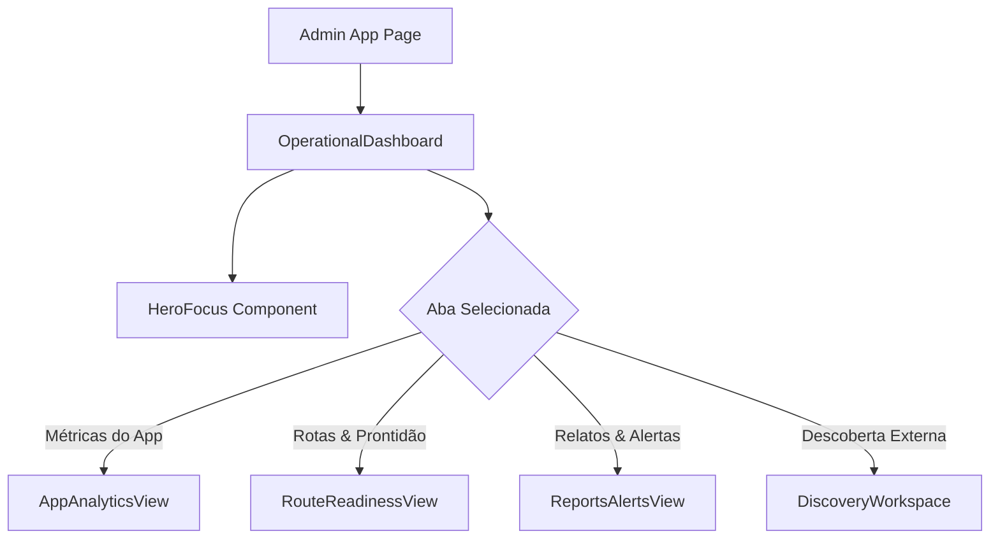

# Design - Painel Operacional Administrativo (Reflexo do App)

## Arquitetura de Componentes (`apps/admin`)

```text
apps/admin/src/app/
├── page.tsx                         # Entry point com Header e Layout
├── operational-dashboard.tsx        # Controller de estado, abas e seletor de região
├── styles.css                       # Tokens e utilitários visuais
└── components/
    ├── hero-focus.tsx               # Card de ação recomendada (Foco TDAH)
    ├── app-analytics-view.tsx       # Visão de métricas e acessos aos pontos
    ├── route-readiness-view.tsx     # Tabela de prontidão e estado editorial
    ├── reports-alerts-view.tsx      # Central de triagem de relatos da comunidade
    └── discovery-workspace.tsx      # Busca efêmera Google Places (Aba 4)
```

## Fluxo de Estado e Dados



## Design System Tokens Utilizados
- Primary: `var(--color-primary)` (`#33601E`)
- Accent / Focus: `var(--color-accent)` (`#F8C900`)
- Surface: `var(--color-surface)`
- Surface Subtle: `var(--color-surface-subtle)`
- Danger: `var(--color-danger)` / `var(--color-danger-surface)`
- Text Muted: `var(--color-text-muted)`
- Border: `var(--color-border)`
