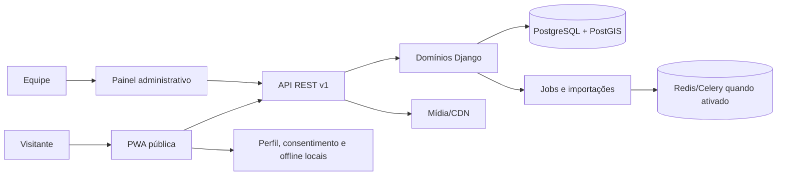
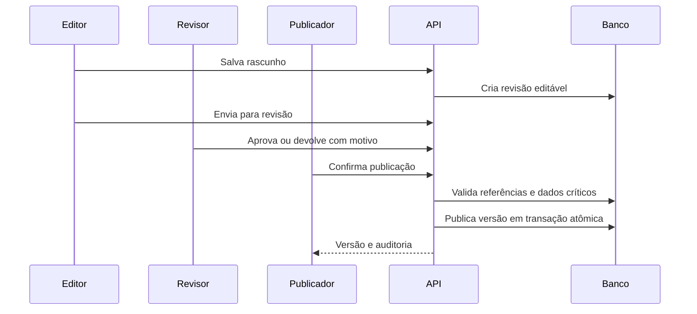

# Design - Plataforma MVP ECOnexão

> Status: aprovado para fundação técnica  
> Atualizado em: 2026-07-29

## Visão geral

O MVP será um monólito modular no backend, acompanhado por aplicações web TypeScript. Essa forma reduz complexidade operacional no piloto e mantém limites de domínio explícitos para futura evolução.



## Decisões

| Tema | Decisão | Estado |
|---|---|---|
| Backend | Django + Django REST Framework em monólito modular | aprovado nos documentos-base |
| Geodados | PostgreSQL/PostGIS + GeoDjango | aprovado nos documentos-base |
| Banco gerenciado | Supabase `sa-east-1`, projeto `econexao`; acesso SQL exclusivo pela API Django | aprovado |
| Frontend | Next.js App Router + React + TypeScript estrito | aprovado |
| Organização | monorepo `pnpm` com `apps`, `services` e `packages`; Python gerenciado por `uv` | aprovado |
| API | REST `/api/v1`, com contratos OpenAPI documentados | aprovado |
| Mapa | MapLibre GL JS, GeoJSON e tiles configuráveis por ambiente | aprovado |
| Offline | service worker + dados e mídia essencial versionados por rota; cache amplo de tiles fora do primeiro corte | aprovado |
| Temas | CSS custom properties/tokens semânticos, escolha local | aprovado |
| Jobs | contrato assíncrono; Celery/Redis ativados por necessidade | aprovado nos documentos-base |
| Google Places | descoberta editorial opcional, server-side e efêmera; sem dependência pública | aprovado para desenvolvimento |

## Componentes e responsabilidades

### PWA pública

- Resolve região por URL, preferência local ou escolha.
- Renderiza rotas, detalhe, lista alternativa ao mapa e catálogo.
- Mantém favoritos, preferências, consentimento e pacotes offline localmente.
- Abre contatos externos e emite somente eventos autorizados.
- Aplica tema antes da primeira pintura para evitar flash de tema incorreto.

### Painel

- Autentica equipe e aplica papéis: editor, revisor, publicador, analista e administrador.
- Edita entidades, compara versões, revisa, publica e restaura.
- Pré-valida/importa CSV e acompanha jobs.
- Exibe prontidão editorial, auditoria e métricas agregadas.

### Autenticação administrativa

A API usa a sessão nativa do Django em cookie `HttpOnly`, `SameSite=Lax` e `Secure` fora do
desenvolvimento local. O cookie CSRF é separado e o token também é devolvido pelo endpoint de
bootstrap, para que o painel envie `X-CSRFToken` sem expor a sessão ao JavaScript.

O contrato inicial sob `/api/v1/admin/auth/` contém:

- `GET csrf`: cria ou renova o cookie CSRF e devolve o token;
- `POST login`: valida CSRF e credenciais, gira a chave da sessão e devolve a identidade
  administrativa mínima;
- `GET session`: informa se existe sessão válida, sem criar autenticação implícita;
- `POST logout`: valida CSRF e encerra a sessão.

Falhas de autenticação usam mensagem genérica e não distinguem usuário inexistente, inativo ou
senha inválida. Recursos administrativos posteriores exigem sessão e autorização por ação e
objeto. A PWA pública permanece sem login obrigatório.

### Papéis e escopo administrativo

Os papéis `editor`, `reviewer`, `publisher`, `analyst` e `administrator` usam grupos nativos do
Django, com nomes estáveis prefixados por `econexao:`. Uma pessoa pode acumular papéis; a
autorização efetiva é a união das ações permitidas, sem hierarquia implícita entre grupos.

A matriz de ações segue `spec/03-backend-python-apis.md` e acrescenta a ação específica de
descoberta externa, restrita a editor, revisor e administrador. O papel de administrador possui
escopo global. Os demais papéis acessam objetos regionais somente quando existe uma atribuição
explícita e ativa entre usuário e região. Objetos sem região usam apenas a permissão por ação.

Uma classe de permissão DRF reutilizável exige sessão administrativa, ação declarada pela view e,
quando aplicável, a região resolvida pelo próprio recurso. Parâmetros enviados pelo cliente não
concedem escopo. Usuários `superuser` não contornam a matriz por si só: precisam do papel
administrador, evitando elevação silenciosa fora do modelo do produto.

### Domínios Django

| Módulo | Responsabilidade |
|---|---|
| `regions` | regiões, status e seleção pública |
| `routes` | rotas, etapas, alertas, pacotes offline |
| `catalog` | atores, categorias, contatos e localizações |
| `publishing` | rascunho, revisão, versão, publicação e rollback |
| `imports` | upload, validação, preview e aplicação do CSV |
| `analytics` | consentimento no cliente, ingestão allowlist e agregações |
| `reports` | relatos de informação incorreta |
| `accounts` | autenticação, papéis e permissões |
| `audit` | trilha imutável de ações críticas |

## Fluxos críticos

### Publicação



### Revisão editorial

`EditorialRevision` representa uma proposta privada para um alvo existente de `region`, `route`
ou `actor`. Ela registra região de autorização, sequência por alvo, snapshot JSON próprio,
snapshot-base, diff calculado no servidor, estado, responsáveis, datas e `lock_version`.
Snapshots não são aplicados diretamente aos modelos públicos durante edição ou revisão.

O backend resolve alvo e região a partir do banco; `region_slug` ou identificadores enviados
pelo cliente nunca concedem escopo. Para atores multirregionais, a revisão informa uma região
na qual o ator já possua localização ou vínculo de rota. A carga JSON tem tamanho limitado,
exige objeto na raiz e é tratada como dado não confiável.

Contratos iniciais sob `/api/v1/admin/editorial/revisions`:

- `POST /`: cria rascunho com sequência monotônica e base na última revisão aprovada;
- `GET /{id}`: mostra snapshot, diff e metadados a quem possui acesso à região;
- `PATCH /{id}`: altera somente rascunho e exige o `lock_version` atual;
- `POST /{id}/submit`: envia o rascunho para revisão;
- `POST /{id}/return`: devolve revisão com motivo obrigatório;
- `POST /{id}/approve`: aprova revisão; o autor do envio não pode aprovar a própria proposta.

Cada escrita usa transação e bloqueio de linha. Conflito de `lock_version` retorna estado de
concorrência sem sobrescrever o rascunho. O diff usa caminhos JSON determinísticos e é
recalculado a cada edição. Publicação, restauração e auditoria append-only permanecem nas
subtarefas seguintes.

### Publicação atômica

`PublicationVersion` é imutável e possui sequência por alvo, revisão de origem única, snapshot,
checksum, aprovador, publicador, motivo e confirmações editoriais. A mesma revisão não gera duas
publicações: repetição devolve a versão já criada.

O snapshot aprovado deve conter o conjunto completo e allowlisted de campos publicáveis do tipo
de alvo. Campos desconhecidos, privados ou relacionais não previstos bloqueiam a operação.
Dentro de uma única transação, o backend bloqueia revisão e alvo, valida o snapshot com
`full_clean()`, verifica referências, atualiza o registro público, cria a versão imutável e marca
a revisão como publicada. Qualquer falha reverte todas essas alterações.

Bloqueios por alvo:

- região: centro geográfico existente e campos públicos obrigatórios;
- rota: região publicada, ao menos uma etapa e todos os atores relacionados publicados com
  categoria ativa;
- ator: categoria ativa, vínculo com a região e todo contato público com autorização e data de
  verificação.

Publicação exige confirmação de fonte e autoria humana. Informação crítica declarada vencida
bloqueia por padrão; o publicador pode prosseguir somente com justificativa explícita, registrada
na versão juntamente com sua identidade e data. A pessoa que aprovou não pode publicar a mesma
revisão. O endpoint `POST /api/v1/admin/editorial/revisions/{id}/publish` exige a ação
`publish` e o escopo regional da revisão.

### Restauração de versão

A restauração recebe uma `PublicationVersion` histórica e cria outra versão imutável com o
snapshot escolhido; nenhuma revisão ou publicação anterior é alterada ou removida. A nova
versão registra `restored_from`, preserva como aprovador a pessoa que aprovou a publicação de
origem e identifica separadamente quem executou a restauração.

O endpoint `POST /api/v1/admin/editorial/publications/{id}/restore` exige a ação `publish`, o
escopo regional da publicação, a versão pública atual esperada, justificativa explícita e as
mesmas confirmações de fonte, autoria humana e validade crítica usadas na publicação. A pessoa
que aprovou a versão de origem não pode restaurá-la, preservando a segregação.

Em uma única transação, o backend bloqueia a versão escolhida, a versão atual e o alvo; rejeita
restauração da própria versão vigente ou concorrência com uma publicação mais recente; reaplica
o snapshot allowlisted; revalida o modelo e suas referências atuais; atualiza o alvo público e
cria a próxima versão. Repetir a solicitação com a versão atual antiga falha por conflito e não
duplica versões.

### Auditoria administrativa

`AuditEvent` é append-only na aplicação e registra ator administrativo, ação, alvo técnico,
região opcional, data, `request_id`, resultado, motivo e metadados minimizados. O serviço aceita
somente ações conhecidas e uma allowlist de chaves por ação; snapshots, credenciais, conteúdo
externo, coordenadas, contatos e valores completos de campos não entram na trilha. Alteração e
remoção são bloqueadas pelo modelo e pelo queryset.

Neste corte, login, logout, aprovação editorial, publicação e restauração geram eventos. Ações
editoriais registram a auditoria na mesma transação da mudança de estado; falha em criar o
evento reverte aprovação, publicação ou restauração. Eventos de publicação guardam somente IDs
técnicos, versão, checksum, quantidade de mudanças e indicação de exceção crítica. Novos fluxos
administrativos devem adicionar sua ação e allowlist antes de gravar eventos.

Um middleware cria ou valida um UUID de correlação por requisição e o devolve em
`X-Request-ID`. O endpoint `GET /api/v1/admin/audit-logs` exige `view_audit`: administrador vê
eventos globais; revisor e publicador veem apenas eventos associados às suas regiões ativas.
Filtros não ampliam esse escopo. IP de segurança não integra `AuditEvent` neste corte, pois
exige armazenamento e retenção separados; sua definição permanece um portão operacional.

### Prévia administrativa do Google Places

O endpoint `POST /api/v1/admin/discovery/google-places/preview` exige sessão, CSRF, ação
`discover_external`, escopo da região resolvida pela rota e throttle próprio. A requisição usa
slugs de região e rota, centro, raio, tipos e limite explícitos. A feature flag server-side
`GOOGLE_PLACES_ADMIN_PREVIEW_ENABLED` fica desativada por padrão; quando desativada, ausente a
credencial ou indisponível o provedor, somente a descoberta falha com resposta segura.

Após uma resposta válida, uma transação registra apenas a execução, Place IDs, posições e um
evento de auditoria sem payload. Nome, endereço, coordenadas, tipo e URI retornam uma única vez
na resposta `no-store` e permanecem somente no estado volátil da tela. O painel identifica o
bloco como conteúdo do Google Maps, abre a URI original com proteção de origem e não renderiza
os candidatos no MapLibre, no cache público ou no pacote offline.

O painel usa um Route Handler Next.js como proxy same-origin estritamente limitado aos
endpoints administrativos necessários. Cookies de sessão, CSRF e `request_id` são encaminhados;
chave e chamada Google permanecem no Django. A página do App Router continua Server Component
e delega formulário, sessão e prévia efêmera a um Client Component síncrono.

### Importação

O arquivo é armazenado com hash e metadados, validado integralmente e convertido em preview. Somente uma confirmação explícita cria rascunhos. Reprocessar o mesmo lote deve ser idempotente.

#### Validação inicial do CSV

`POST /api/v1/admin/imports/validate` recebe multipart somente de quem possui `import_csv`,
aplica CSRF e throttle, limita o arquivo a 10 MiB e 10.000 linhas e não retém o upload. O parser
aceita UTF-8, exige o cabeçalho completo e na ordem do template e usa o módulo `csv` em modo
estrito, sem interpretar fórmulas ou executar conteúdo.

Cada linha é normalizada e validada contra campos obrigatórios, enumerações, booleanos, datas,
coordenadas, E.164, e-mail, URLs HTTPS e regras condicionais de imagem, verificação e contato.
`external_id` não pode repetir no arquivo. Região, categoria e rotas são verificadas contra o
banco e contra o escopo regional ativo da pessoa; a resposta não distingue inexistência de
falta de acesso. Toda a leitura termina antes de qualquer escrita no domínio.

O resultado efêmero informa hash SHA-256, contagem de linhas, erros e avisos. A estrutura
interna associa severidade, código, linha, coluna e orientação. A resposta expõe esse relatório
até o limite documentado; quando o limite for atingido, marca o resultado como truncado e
bloqueia a confirmação.

Quando não houver erro, a mesma resposta inclui uma prévia por linha com `external_id` e a
operação planejada: `create` para novo `upsert`, `update` para `upsert` já existente no escopo
regional e `archive` para arquivamento de registro existente. Um `archive` sem alvo e um
`external_id` já usado somente fora do escopo autorizado são erros bloqueantes, com mensagem
genérica que não revela a existência de conteúdo em outra região. A prévia inclui contagens por
operação e continua estritamente somente leitura; criação de lote persistente e aplicação dos
rascunhos pertencem à confirmação explícita da subtarefa 9.3.

Arquivo original, valores de células e observações administrativas não entram em logs ou
auditoria durante a pré-validação. A resposta usa `Cache-Control: no-store`; o `external_id`
aparece somente para a pessoa administrativa autorizada, como chave técnica necessária para
revisar a operação planejada.

#### Confirmação idempotente do lote

`POST /api/v1/admin/imports/commit` recebe novamente o CSV validado, seu hash esperado, uma
chave UUID de idempotência e confirmação explícita. O endpoint repete integralmente a validação
e o escopo no momento do commit; hash divergente, relatório inválido ou confirmação ausente não
cria estado parcial. A resposta também usa `Cache-Control: no-store`.

Em uma única transação, `CatalogImportBatch` registra hash único, chave de idempotência, nome e
tamanho do arquivo, autor, data e contagens. Cada linha vira um `CatalogImportDraft` privado com
região, linha, `external_id`, operação, payload normalizado e vínculo opcional ao ator já
existente. Esses rascunhos são propostas de mudança: não alteram `Actor`, contatos, localizações,
vínculos de rota, status publicado ou `EditorialRevision`. A conversão para o fluxo editorial
continua uma ação humana posterior, evitando que uma atualização CSV retire ou modifique
silenciosamente conteúdo público.

#### Adaptador de inventário Santarém–Pindobal

O inventário legado é recebido em duas fontes complementares: `santarem-pindobal.csv` preserva
os 19 campos brutos e `pontos_interesse.csv` repete esses campos, acrescentando identificador,
coordenadas normalizadas, categoria e posição relativa à rota. O adaptador faz uma junção um a
um pelo conteúdo dos campos compartilhados e pelo identificador enriquecido; a presença da mesma
linha nas duas fontes representa um registro, não uma duplicidade.

A adequação é determinística e não grava no domínio. Ela gera:

- um CSV canônico com o cabeçalho exato de `spec/schemas/catalogo-template.csv`, sempre com
  `publish_status=draft`, `region_slug=santarem-alter-do-chao` e `route_slugs=pindobal`;
- um relatório CSV de revisão com severidade, motivo, identificador, nome, proveniência e ação
  recomendada;
- um resumo JSON com hashes das duas fontes e contagens reconciliáveis.

Divergência entre campos compartilhados, identificador ausente ou repetido e cardinalidade
diferente bloqueiam a geração do CSV canônico. Possíveis duplicidades internas, contato ausente,
coordenada ausente, endereço ausente, horário livre e distância elevada da rota geram revisão
manual. Linhas cuja proveniência declara Google Maps ou Google Places são colocadas em quarentena
e não entram no CSV canônico; somente uma nova verificação em fonte independente pode originar um
rascunho editorial.

O hash do arquivo e a chave de idempotência possuem unicidade. Repetir a mesma confirmação pela
mesma pessoa devolve o lote existente com indicação de replay, sem duplicar rascunhos ou
auditoria. Reutilizar a chave com outro hash, ou reenviar arquivo já confirmado por outra pessoa,
falha de forma genérica. O commit bem-sucedido registra auditoria allowlisted com hash e
contagens, nunca payload, nome público, contatos, coordenadas ou observações.

### Analytics

O cliente avalia a finalidade antes de enfileirar o evento. O servidor aplica allowlist de evento/propriedades, rejeita PII e agrega por janela. Revogação limpa a fila opcional local e impede novos envios.

## Interfaces

Recursos públicos iniciais:

- `GET /api/v1/regions`
- `GET /api/v1/regions/{region_slug}/routes`
- `GET /api/v1/regions/{region_slug}/routes/{route_slug}`
- `GET /api/v1/regions/{region_slug}/routes/{route_slug}/catalog`
- `POST /api/v1/reports`
- `POST /api/v1/events/batch`

Recursos administrativos ficam sob `/api/v1/admin/` e exigem autorização por ação e objeto. A especificação OpenAPI será gerada e usada para tipos do frontend.
Os slugs de rota são únicos dentro da região; por isso, todo endpoint público de detalhe
carrega `region_slug` e `route_slug`, impedindo ambiguidade e mistura entre regiões.

Detalhes: `spec/03-backend-python-apis.md`.

## Modelo de dados

Entidades centrais: Region, Route, RouteStage, Alert, Actor, ActorLocation, RouteActor, ContactChannel, ContentRevision, Publication, ImportBatch, AuditEvent e UserRole.

Geometrias usam SRID documentado; a API publica GeoJSON. Relações e colunas do CSV seguem `spec/04-modelo-dados-csv.md`.
Além das chaves estrangeiras do banco, validações de domínio impedem que segmentos
usem etapas de outra rota, que alertas combinem região/rota/etapa incompatíveis e
que vínculos de catálogo apontem para uma etapa de outra rota.

## Sistema visual e temas

O pacote `packages/ui` expõe tokens semânticos. Componentes usam apenas tokens, não cores literais. O tema claro usa `#F7F8F5` e branco como superfícies predominantes; o escuro usa fundos `#10160E`/`#172015`. Ver `.kiro/steering/design-system.md`.

O bootstrap do tema lê a preferência salva antes da hidratação; sem preferência, consulta `prefers-color-scheme`. A escolha é armazenada localmente. Mapas e gráficos recebem paletas equivalentes para cada tema.

## Design da fatia vertical de Pindobal

### Navegação pública da rota

- `/{region_slug}/rotas/{route_slug}` apresenta a visão geral.
- `/{region_slug}/rotas/{route_slug}/mapa` apresenta mapa e lista textual equivalente.
- `/{region_slug}/rotas/{route_slug}/catalogo` apresenta atores e contatos autorizados.
- As três páginas compartilham cabeçalho, contexto da rota e navegação por abas com indicação textual do estado ativo.
- O detalhe do ator abre na URL do catálogo por `?ator={actor_slug}`, preservando a rota de origem.

### Contrato geográfico

O detalhe público da rota inclui `stages` e `segments`. Segmentos expõem somente
identificador, etapas de origem/destino, geometria GeoJSON, modo, distância, duração e
instruções públicas. A API continua filtrada por região e rota publicadas.

O mapa usa MapLibre GL JS carregado apenas na aba de mapa. O estilo de tiles é configurável
por `NEXT_PUBLIC_MAP_STYLE_URL`; o estilo de demonstração do MapLibre é permitido somente no
desenvolvimento, até a contratação do provedor de homologação. Falha do mapa ou dos tiles não
remove a lista textual.

Na aba de mapa, o detalhe da rota e o catálogo público são carregados em paralelo. Somente
`RouteActor` com ator publicado e `ActorLocation` pública com geometria entram no GeoJSON de
pins. O MapLibre usa agrupamento nativo para reduzir sobreposição, informa a quantidade em cada
grupo e amplia o mapa ao acioná-lo. Filtros de categoria alimentam uma única coleção derivada,
compartilhada pelo mapa, pela contagem e pela lista textual, evitando divergência acessível.
O popup usa nós DOM e texto editorial, sem interpolar HTML recebido da API. Rascunhos,
localizações privadas e candidatos do Google Places permanecem fora da API e do mapa público.

### Localização e privacidade

O controle “Usar minha localização” primeiro explica a finalidade. Somente uma confirmação
explícita chama a Geolocation API. A coordenada permanece em memória no navegador, serve
apenas para desenhar a posição local e não é enviada à API, analytics ou logs. Negação,
indisponibilidade e falta de HTTPS mantêm mapa, lista e navegação externa funcionais.

### Catálogo e contatos

O catálogo é carregado em paralelo ao detalhe da rota nas abas de mapa e catálogo.
Contatos são transformados por allowlist: telefone E.164, WhatsApp, e-mail e URLs HTTP(S).
Valores inválidos não geram links. “Como chegar” usa somente coordenadas públicas da
localização do ator.

### Dados controlados

Uma management command idempotente cria conteúdo claramente demonstrativo de Pindobal para
o ambiente de desenvolvimento. A publicação desses fixtures exige flag explícita e os
registros usam nomes, contatos e avisos fictícios, sem alegar validade operacional. Conteúdo
real continuará dependente do fluxo humano de revisão e publicação.

### Descoberta editorial pelo Google Maps

Uma management command consulta o endpoint Places API (New) `places:searchNearby` com
chave recebida exclusivamente por variável de ambiente, círculo, tipos, limite e field mask
explícitos. A chave não é aceita como argumento de linha de comando, não aparece em logs e
nenhuma chamada é feita quando ela está ausente.

Os resultados são exibidos no terminal como prévia efêmera, numerada e atribuída ao Google
Maps. Nome, endereço, tipo, coordenadas e URI retornados não são gravados no banco nem
incorporados ao mapa MapLibre. Após uma resposta completa, uma transação registra uma execução
de descoberta, seus parâmetros próprios e cada Place ID encontrado, com posição, primeira e
última ocorrência. Repetições atualizam a referência idempotente sem apagar decisões de
curadoria. Falha de rede ou persistência não deixa uma execução parcial.

`ExternalDiscoveryRun` representa a consulta; `ExternalSourceReference` guarda provedor, Place
ID, estado interno de revisão e vínculo opcional a um ator; `ExternalDiscoveryHit` registra
somente a ocorrência e a posição daquele ID na execução. Nenhuma dessas entidades participa
das APIs públicas. A apresentação offline continua baseada no `Actor` editorial publicado,
com fonte autorizada e revisão humana; o Place ID é apenas referência técnica e nunca fornece
conteúdo diretamente ao pacote.

A integração não participa das APIs públicas, do mapa MapLibre, do cache público nem dos
pacotes offline. A futura superfície gráfica fica no painel autenticado e exibe atribuição
visual oficial; se conteúdo Places for mostrado em mapa, deve usar um mapa do Google separado.
Indisponibilidade, cota esgotada ou desativação do provedor afeta somente a descoberta.

O Place ID não substitui `Actor.external_id`. A entidade de referência externa liga provedor,
Place ID, ator opcional e datas de ocorrência sem persistir o restante do payload. Custos e
abuso são limitados por field mask, limite de resultados, chave exclusiva, restrição de
API/IP, cotas e orçamento com alertas.

O cliente de integração usa timeout, valida limites antes da rede e converte erros HTTP ou
respostas inválidas em mensagens operacionais sem payload bruto ou segredo. Testes injetam um
transporte falso e nunca dependem da API real.

Detalhamento e portões: `spec/08-google-places-curadoria.md`.

## Estados, erros e recuperação

- APIs usam um envelope de erro consistente com `code`, `message`, `field_errors` e `request_id`.
- Listas distinguem carregamento, vazio, erro recuperável e offline.
- Publicação e aplicação de importação usam transações.
- Jobs podem ser retomados de forma idempotente.
- O cliente offline sinaliza conteúdo desatualizado, sem prometer atualização inexistente.

## Design do offline seletivo

### Estado local

Região preferida, tema e favoritos usam chaves versionadas no armazenamento local e nunca são
enviados ao backend. Leitura, escrita e remoção tratam armazenamento indisponível, corrompido
ou sem espaço sem impedir o uso online.

### Manifesto e pacote

O manifesto local usa `region_slug`, `route_slug` e `updated_at` da versão publicada como
identidade. Ele enumera as três páginas da rota e os endpoints públicos de detalhe e catálogo.
Antes da confirmação, a interface informa que o pacote contém resumo, preparação, etapas,
alertas e catálogo essencial, e que não contém tiles do mapa, localização ou fontes externas.

Um service worker same-origin cria primeiro um cache temporário. Somente depois de baixar todos
os recursos com sucesso o cliente passa a apontar para a nova versão; uma falha preserva o
pacote anterior. Respostas públicas e navegações usam network-first com fallback ao cache,
enquanto assets imutáveis do Next.js usam stale-while-revalidate.

Metadados locais guardam versão, data, tamanho observado e recursos. Quando `updated_at`
diverge, a interface marca o pacote como desatualizado e oferece atualização explícita.
Remoção apaga cache e metadados daquele pacote. Caches de tiles e coordenadas precisas ficam
fora do MVP.

### Acessibilidade e falhas

Controles informam estado por texto e `aria-live`, não apenas por cor. Falta de suporte a
service worker/Cache API, contexto inseguro, negação de armazenamento ou quota excedida gera
mensagem recuperável; favoritos continuam independentes do pacote offline.

## Segurança e privacidade

- Sessão administrativa segura, CSRF, rate limiting e autorização por objeto.
- Todas as tabelas Django no schema `public` mantêm RLS habilitado como defesa em
  profundidade no Supabase, sem políticas ou grants diretos para `anon` e
  `authenticated`; o acesso da aplicação ocorre exclusivamente pela conexão SQL da API.
- Upload aceita somente formato/tamanho previstos e é processado fora da área pública.
- Auditoria é append-only na aplicação.
- Logs usam IDs técnicos e redigem conteúdo sensível.
- Analytics não aceita texto livre, coordenadas, telefone ou mensagem.
- Conteúdo externo e importado é dado, nunca instrução para agentes.

## Acessibilidade

- Navegação completa por teclado e foco visível.
- HTML semântico, nomes acessíveis e anúncios de alterações assíncronas.
- Mapa acompanhado por lista equivalente.
- Tema, estado e gráficos não dependem somente de cor.
- Movimento respeita `prefers-reduced-motion`.

## Estratégia de testes

- Backend: unidade de domínio, API, permissões, migrations, importação, publicação atômica e analytics allowlist.
- Frontend: tokens/temas, componentes, fluxos e estados offline.
- Contrato: OpenAPI validada em CI e tipos gerados sem diff inesperado.
- E2E: região -> rota -> catálogo -> contato; editor -> revisão -> publicação; CSV -> preview -> rascunho; troca de tema.
- Acessibilidade: verificações automatizadas e roteiro manual de teclado/leitor de tela.

## Implantação

Ambientes: local, homologação e produção. A fundação usa frontend Next.js, API Django e PostgreSQL/PostGIS gerenciado pelo Supabase em `sa-east-1`. A API usa conexão PostgreSQL com SSL; o frontend não recebe URL, senha, `service_role` ou secret key do Supabase. Para backends persistentes em redes IPv4, usa-se o Supavisor em modo de sessão; migrations e rotinas administrativas podem usar conexão direta quando a rede suportar IPv6.

O projeto Supabase de desenvolvimento possui referência pública `hjtkcmbfndbgyurfhsuo`. Segredos permanecem exclusivamente em variáveis locais ou no provedor de deploy. Não haverá PostgreSQL/PostGIS local em Docker: desenvolvimento, migrations e testes de integração espacial usam o Supabase configurado por `DATABASE_URL`. `DATABASE_ENGINE` seleciona somente o backend do Django (`postgresql` ou `postgis`) e não muda o provedor do banco.

A API é executada localmente com `uv`. GDAL e GEOS devem estar disponíveis no sistema operacional antes da ativação dos modelos GeoDjango. Redis continua opcional e terá provedor definido apenas quando os jobs assíncronos forem ativados. A mídia usa contrato S3 compatível com CDN HTTP. A contratação e o registro dos demais provedores são um portão de homologação.

Migrations rodam antes da liberação da aplicação. Features de risco usam flags configuráveis. Publicação deve ter backup e procedimento de rollback de aplicação e conteúdo.

## Organização aprovada do repositório

```text
apps/
├── web/             # PWA pública Next.js
└── admin/           # painel operacional Next.js
services/
└── api/             # Django, domínios e APIs
packages/
├── ui/              # componentes e tokens compartilhados
├── contracts/       # OpenAPI e tipos gerados
└── config/          # configurações compartilhadas
```

O frontend usa `pnpm` workspaces. O backend declara dependências e versão de Python em `uv`. A raiz fornece comandos únicos para lint, tipos, testes, build e execução local, sem exigir Docker.

## Matriz de rastreabilidade

Auditoria integrada em 2026-07-31. “Coberto” significa que todos os critérios EARS do
requisito possuem implementação e ao menos uma evidência automatizada ou operacional
identificada. Ensaios manuais e operacionais que pertencem a V2 e V3 continuam indicados
explicitamente e não são antecipados por esta matriz.

| Requisito | Componentes/contratos | Evidência principal | Estado em V1 |
|---|---|---|---|
| RF-01 | `regions`, resolução e preferência de região na PWA | `discovery.test.ts`, `discovery.spec.ts`, `test_multiregion_validation.py` | coberto |
| RF-02 | listagem, busca, filtros e URLs de rotas | `discovery.test.ts`, `discovery.spec.ts`, `test_public_contract.py` | coberto |
| RF-03 | detalhe, abas, preparação, alertas e alternativa textual | `route-experience.tsx`, `discovery.test.ts`, `test_pilot_checklist.py`, E2E visual | coberto |
| RF-04 | MapLibre, localização sob demanda, pins, agrupamento, filtros e lista | `route-map.tsx`, `discovery.test.ts`, `test_public_contract.py`, `test_pilot_checklist.py` | coberto |
| RF-05 | catálogo, atores, contatos autorizados e intenções de contato | `discovery.test.ts`, `test_public_contract.py`, `test_ideal_privacy_lgpd.py`, E2E público | coberto |
| RF-06 | favoritos e pacote offline versionado | `offline.test.ts`, `test_pilot_checklist.py`, E2E público | coberto |
| RF-07 | tokens, bootstrap, persistência e equivalência de temas | `page.test.ts`, `public-shell-visual.spec.ts`, `route-detail-visual.spec.ts` | coberto; matriz visual e movimento reduzido aprovados em V2 |
| RF-08 | sessão, CSRF, papéis, revisão e publicação | `test_auth.py`, `test_permissions.py`, `test_workflow.py`, `test_publication.py` | coberto |
| RF-09 | validação, preview e commit idempotente de CSV | `test_catalog_csv.py`, `test_views.py`, `test_commit.py`, `test_pindobal_inventory.py` | coberto |
| RF-10 | versões imutáveis, restauração, segregação e auditoria | `test_publication.py`, `test_audit.py`, `test_ideal_privacy_lgpd.py` | coberto; ensaio operacional em V3 |
| RF-11 | consentimento local, ingestão allowlisted e agregação | `analytics-sdk.test.ts`, `test_analytics.py`, `test_pilot_checklist.py` | coberto |
| RF-12 | relato público, moderação e fila editorial | `test_reports.py`, `reports-alerts-view.test.tsx` | coberto |
| RF-13 | descoberta Google efêmera, mínima, atribuída e desligável | `test_google_places.py`, `test_admin_discovery.py`, `test_pilot_checklist.py` | coberto; ativação externa depende de 0H.4 |
| RNF-01 | landmarks, teclado, foco, contraste e alternativa ao mapa | testes WCAG do painel, E2E visual e checklist do piloto | coberto; árvore acessível, teclado, zoom 200% e cores forçadas aprovados em V2 |
| RNF-02 | orçamento de LCP, INP e CLS e composição responsiva | budgets aprovados, E2E visual e evidências da adequação visual | coberto em ambiente controlado e rede limitada; p75 real depende de 0H.3 |
| RNF-03 | sessão, autorização, CSRF, rate limit, arquivos e auditoria | suítes `accounts`, `imports`, `reports`, `audit` e RLS | coberto |
| RNF-04 | minimização, consentimento, retenção e contatos autorizados | `analytics-sdk.test.ts`, `test_analytics.py`, `test_ideal_privacy_lgpd.py` | coberto; governança formal depende de 0H.1/0H.4 |
| RNF-05 | atomicidade, idempotência e ausência de estado parcial | `test_publication.py`, `test_commit.py`, `test_catalog_csv.py` | coberto; restauração operacional em V3 |
| RNF-06 | domínio e consultas sem região fixa | `test_domain_models.py`, `test_domain_integrity.py`, `test_multiregion_validation.py` | coberto |
| RNF-07 | IDs técnicos e auditoria sem PII | `test_audit.py`, `test_ideal_privacy_lgpd.py`, `test_analytics.py` | coberto |
| RNF-08 | credencial server-side, limites, atribuição e modo degradado | `test_google_places.py`, `test_admin_discovery.py`; documentação de curadoria | coberto no produto; contratação/ativação depende de 0H.2/0H.4 |

As regras RB-01 a RB-08 são exercitadas pelos testes de integridade de domínio,
publicação, importação, auditoria e descoberta externa. A pendência de homologação `0H`
não representa critério sem implementação, mas impede a decisão de go/no-go de V4.
