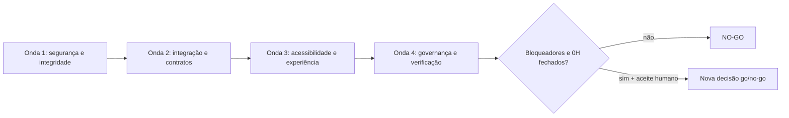

# Design — revisão pós-implementação da Plataforma MVP

> Depende de: `bugfix.md` aprovado

## Visão geral

As correções serão executadas em quatro ondas dependentes: contenção e segurança; integração e
contratos; acessibilidade e experiência; governança e verificação. Mudanças de modelo e contrato
precedem os consumidores frontend. Cada defeito recebe primeiro um teste de regressão que demonstre
a falha, seguido da menor correção compatível com a arquitetura atual.

## Decisões e alternativas

- **Transações:** moderação e auditoria usarão `transaction.atomic`; nenhuma auditoria será criada
  depois de um commit implícito.
- **Autorização:** reutilizar `HasAdminAction` e os escopos regionais existentes. Não criar uma
  segunda matriz de permissões.
- **Relatos:** manter o texto original imutável; moderação usa campos próprios de status, nota e
  responsável. O alvo será validado contra o domínio publicado e sua região.
- **Analytics:** substituir denylist por schemas de propriedades por evento. Chaves e tipos não
  declarados serão recusados; validação será recursiva e os campos contextuais terão enums/limites.
- **Agregação:** usar atualização atômica no banco (`F()` ou upsert equivalente) dentro de
  transação, sem incremento em memória.
- **RLS:** criar migrations reversíveis com `RunSQL` e teste de `relrowsecurity`, seguindo o padrão
  já existente no repositório.
- **Retenção:** criar comando idempotente de expurgo com janela configurável e evidência de execução;
  agendamento de produção permanece condicionado ao provedor de jobs.
- **Roteamento:** adotar um único contrato de proxy por aplicação. Web encaminha endpoints públicos;
  admin encaminha endpoints administrativos e bootstrap de autenticação. URLs diretas `/api/v1`
  não ficam espalhadas nos componentes.
- **CSRF:** toda mutação administrativa passa pelo cliente autenticado compartilhado, que obtém e
  envia `X-CSRFToken` e preserva cookies.
- **Editor:** remover qualquer aparência de publicação local. Salvar deve chamar o workflow real e
  apresentar o estado retornado pela API.
- **Acessibilidade:** criar um primitivo reutilizável de diálogo acessível e implementar tabs pelo
  padrão WAI-ARIA, sem testes baseados apenas em busca textual.
- **Tema:** preferência persistida prevalece; na ausência dela, aplicar o esquema do sistema.
- **Seed:** por padrão, criar/atualizar rascunhos sem degradar registros existentes. Publicação só
  poderá ocorrer pelo serviço editorial com confirmação explícita e auditoria.
- **Go/no-go:** agentes podem preparar evidências, mas não assinar aceite humano nem declarar GO.

## Componentes e responsabilidades

### Backend

- `modules/reports`: vínculo de alvo, throttling, autorização, escopo, imutabilidade e transação.
- `modules/analytics`: schemas de evento, throttling, agregação atômica, retenção e autorização.
- `modules/audit`: ação de moderação registrada na allowlist e coberta por teste transacional.
- migrations: RLS para eventos brutos, agregados e relatos.
- seed multirregional: idempotência sem publicação ou regressão de estado.

### Contratos

- OpenAPI descreve respostas reais, erros `400/401/403/404/429` e schemas administrativos.
- Tipos TypeScript são sempre regenerados pelo fluxo oficial; não são editados manualmente.

### Web e painel

- Cliente de API centraliza base URL, proxy, credenciais, CSRF e tratamento de erro.
- Consentimento permanece acessível após a escolha e controla a fila de analytics.
- Diálogos compartilham comportamento de foco e teclado.
- Painel diferencia vazio, carregando, não autorizado e indisponível.

## Modelo de dados e migrations

- Relatos preservam campos originais e recebem metadados separados de moderação.
- Se uma FK polimórfica não for adequada, a validação do alvo será centralizada em serviço de
  domínio e protegida por constraints possíveis; não haverá confiança exclusiva em slugs enviados.
- Novas migrations devem ser reversíveis e não podem apagar relatos/eventos existentes.
- A aplicação de RLS deve incluir políticas mínimas compatíveis com o acesso exclusivo pela API.
- O expurgo de analytics atua por `occurred_at/received_at` conforme a política documentada e
  registra somente contagens e IDs técnicos seguros.

## Estados, erros e recuperação

- Erros de validação: `400`; sem sessão: `401/403` conforme convenção existente; alvo ausente: `404`
  ou erro genérico seguro; throttle: `429`; conflito concorrente: `409` quando aplicável.
- Falha de auditoria provoca rollback integral da moderação.
- Falha do proxy/API mantém a informação digitada no cliente quando seguro e oferece nova tentativa.
- Revogação impede novos envios e remove eventos opcionais ainda não enviados.
- Migrações e seed devem ser ensaiados sobre dados existentes e suportar repetição.

## Segurança e privacidade

- Nenhum teste ou comando lê `.env` ou imprime segredos.
- Contato do relator fica restrito às ações administrativas necessárias e ao escopo regional.
- Analytics não aceita coordenadas, telefones, e-mails, mensagens ou campos arbitrários.
- Descrições de relato recebem limites, sanitização de saída e proteção contra abuso.
- Logs e auditoria não armazenam payload bruto, contato ou nota livre desnecessária.
- Testes cobrem autorização por papel, ação, objeto e região, além de CSRF e throttling.

## Acessibilidade

- Diálogos: nome acessível, `aria-modal`, foco inicial, contenção, `Escape`, restauração e fundo
  inerte quando suportado.
- Tabs: setas, `Home`, `End`, roving `tabIndex`, `aria-controls` e `tabpanel` associado.
- Erros e sucesso usam regiões de status apropriadas e não dependem somente de cor.
- Testes montam componentes e simulam interação real; validação manual cobre teclado e zoom 200%.

## Estratégia de testes

1. Escrever teste que falha reproduzindo cada achado antes da correção.
2. Executar testes focados após cada tarefa.
3. Validar migrations em banco de teste, inclusive reversão e RLS.
4. Validar OpenAPI contra respostas reais, não apenas sincronização de arquivos gerados.
5. Executar integração com web, admin e API em processos separados.
6. Executar concorrência de agregação e atomicidade de moderação.
7. Executar testes de componentes com teclado/foco e E2E dos fluxos críticos.
8. Ao final, executar `pnpm check` e `pnpm test:e2e`.

## Migração e implantação

1. Aplicar migrations de dados/modelo e RLS em staging.
2. Implantar API e confirmar health, permissões, CSRF e throttling.
3. Implantar web/admin com proxies corrigidos.
4. Executar smoke tests sem usar dados pessoais reais.
5. Rodar expurgo em modo de prévia e registrar contagens antes da execução efetiva.
6. Manter decisão `NO-GO` até aceite humano dos resultados e portões `0H`.

## Observabilidade

- Registrar `request_id`, ação, alvo técnico, resultado e duração, sem payload pessoal.
- Alertar para taxas anormais de `400`, `403`, `429` e `5xx` nos fluxos corrigidos.
- Medir divergências entre eventos ingeridos e agregados sem identificadores de visitante.

## Matriz de rastreabilidade

| Resultado | Requisitos | Componentes | Verificação principal |
|---|---|---|---|
| Moderação atômica e auditada | RF-10, RNF-05, RNF-07 | reports, audit | falha de auditoria reverte PATCH |
| Autorização regional | RF-08, RF-10, RNF-03/04 | reports, analytics, accounts | matriz de 401/403/200 |
| Analytics minimizado | RF-11, RNF-04/07 | analytics | payloads proibidos retornam 400 |
| Proteção contra abuso | RF-12, RNF-03 | reports, analytics | limite retorna 429 |
| RLS e retenção | RNF-03/04 | migrations, comando de expurgo | `relrowsecurity=true`; expurgo idempotente |
| Integração frontend/API | RF-08, RF-11, RF-12 | web, admin, API | E2E com serviços separados |
| Workflow editorial real | RF-08, RF-10, RB-06 | admin, publishing | reload preserva rascunho/versionamento |
| Consentimento revogável | RF-11, RNF-04 | web analytics | revogação interrompe e limpa fila |
| WCAG e tema | RF-07, RNF-01 | ui, web, admin | teclado, foco, tema do sistema |
| Multirregional e seed seguro | RF-01, RNF-06, RB-01/06 | seed, publishing | repetição não rebaixa/publica diretamente |
| Governança | RNF-02/04/05/08 | spec e relatório | NO-GO até portões e aceite humano |
