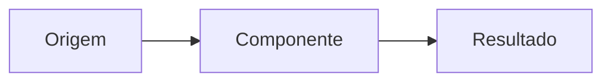

# Design - <nome da feature>

> Depende de: `requirements.md` aprovado

## Visão geral

## Decisões e alternativas

## Arquitetura e fluxo

## Componentes e responsabilidades

## Interfaces e contratos

## Modelo de dados

## Estados, erros e recuperação

## Segurança e privacidade

## Acessibilidade

## Estratégia de testes

## Migração e implantação

## Observabilidade

## Matriz de rastreabilidade

| Requisito | Componente | Verificação |
|---|---|---|
| RF-01 | ... | ... |

