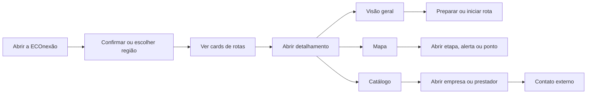

# Especificação de telas, fluxos e botões

> **Escopo:** PWA pública  
> **Princípio:** toda tela importante possui URL compartilhável, estados previsíveis e eventos de interação definidos.

## 1. Arquitetura de navegação

```text
/
├── /rotas
│   └── /rotas/{rotaSlug}
│       ├── /visao-geral
│       ├── /mapa
│       └── /catalogo
├── /catalogo/{atorSlug}
├── /perfil
│   ├── /preferencias
│   ├── /privacidade
│   ├── /offline
│   └── /acessibilidade
├── /buscar
├── /privacidade
├── /termos
└── /ajuda
```

### Navegação principal no celular

- **Início**
- **Rotas**
- **Perfil**

### Navegação principal no desktop

- Logo/Início
- Rotas
- Região ativa
- Busca
- Perfil e configurações

Mapa e catálogo são abas contextuais da rota, não destinos globais da navegação principal.

## 2. Fluxo principal



## 3. Convenções de interface

- Botão primário: uma ação principal por contexto.
- Botão secundário: ações alternativas.
- Link textual: navegação ou informação complementar.
- Botões destrutivos usam cor, texto explícito e confirmação.
- Ícones sempre possuem rótulo acessível.
- Abas alteram a URL e podem ser compartilhadas.
- O botão voltar preserva região, filtros e posição da lista quando possível.
- A troca de região nunca apaga favoritos ou pacotes offline sem confirmação.
- O mapa sempre tem alternativa em lista.

## 4. Tela inicial

**URL:** `/`

### Objetivo

Apresentar a proposta do produto, identificar a região ativa e levar o visitante rapidamente às rotas.

### Blocos

1. Cabeçalho.
2. Seletor de região.
3. Mensagem principal.
4. Busca rápida.
5. Rotas em destaque.
6. Categorias ou interesses.
7. Conteúdo editorial da região.
8. Rodapé e navegação.

### Componentes

| Componente | Conteúdo |
|---|---|
| Região ativa | nome, imagem curta e botão para trocar |
| Hero | promessa, breve explicação e CTA |
| Busca | texto “Busque uma rota, lugar ou serviço” |
| Card de rota | imagem, nome, região, duração, dificuldade, tags e estado offline |
| Interesse | natureza, gastronomia, cultura, comunidades ou outros definidos |

### Botões e ações

| Botão | Resultado | Evento |
|---|---|---|
| `Trocar região` | abre seletor | `region_selector_opened` |
| `Usar esta região` | confirma a região | `region_selected` |
| `Explorar rotas` | abre `/rotas` | `cta_clicked` |
| `Buscar` | abre resultados | `search_submitted` |
| Card de rota | abre a visão geral da rota | `route_card_clicked` |
| `Ver todas as rotas` | abre `/rotas` | `cta_clicked` |
| Categoria/interesse | abre rotas filtradas | `interest_selected` |

### Estados

- Região definida.
- Região não definida.
- Carregando destaques.
- Região sem rotas publicadas.
- Sem conexão com conteúdo em cache.
- Falha de carregamento.
- Banner de atualização disponível.

### Regras

- A região não será inferida por GPS sem ação do visitante.
- Um link de campanha pode definir a região de entrada.
- Se a preferência local existir, ela será usada.
- Se não houver preferência, apresentar escolha explícita; não assumir Tapajós como identidade global.

## 5. Seletor de região

**Formato:** modal no celular e popover/painel no desktop.

### Elementos

- Campo de busca.
- Lista de regiões publicadas.
- Estado “em breve” para regiões anunciadas, se aprovado editorialmente.
- Última região utilizada.

### Botões

| Botão | Resultado |
|---|---|
| Região publicada | troca região e atualiza o catálogo |
| Região “em breve” | abre página informativa, sem dados fictícios |
| `Cancelar` | fecha sem alterar |

### Estados

- Somente Santarém–Alter do Chão publicado no MVP.
- Altamira e Belém poderão aparecer como “em planejamento” apenas se essa comunicação for aprovada.
- Nenhum resultado na busca.
- Falha de rede.

## 6. Tela de rotas

**URL:** `/rotas?regiao={regionSlug}`

### Objetivo

Permitir comparar e filtrar as rotas disponíveis na região atual.

### Elementos

- Título e resumo da região.
- Campo de busca.
- Filtros.
- Ordenação.
- Contagem de resultados.
- Grade/lista de cards.
- Estado dos pacotes offline.

### Filtros iniciais

- Interesse.
- Duração.
- Dificuldade.
- Modal de transporte.
- Disponibilidade offline.
- Acessibilidade, quando houver dado validado.

### Card de rota

- Imagem.
- Nome.
- Localidade.
- Promessa curta.
- Duração.
- Dificuldade.
- Principais modais.
- Tags.
- Aviso crítico ativo, quando aplicável.
- Indicador “salva offline”.

### Botões

| Botão | Resultado | Evento |
|---|---|---|
| `Filtros` | abre painel | `filters_opened` |
| `Aplicar filtros` | atualiza URL e resultados | `filters_applied` |
| `Limpar` | remove filtros | `filters_cleared` |
| `Ordenar` | altera ordem | `sort_changed` |
| Card / `Ver rota` | abre detalhamento | `route_card_clicked` |
| `Salvar offline` | inicia preparação do pacote | `offline_download_started` |

### Estados

- Lista carregada.
- Sem resultado para os filtros.
- Região sem rotas.
- Carregando mais itens.
- Erro de rede.
- Dados em cache e possivelmente desatualizados.

## 7. Detalhamento da rota

**URL base:** `/rotas/{rotaSlug}`  
**Redirecionamento padrão:** `/rotas/{rotaSlug}/visao-geral`

O clique no card abre uma página completa, e não apenas um modal, para garantir URL compartilhável, SEO, retorno consistente e espaço para o conteúdo. A transição visual pode dar a sensação de expansão do card.

### Cabeçalho da rota

- Voltar.
- Nome.
- Região.
- Estado de atualização.
- Favoritar.
- Compartilhar.
- Menu de opções.

### Abas fixas

1. **Visão geral**
2. **Mapa**
3. **Catálogo**

Cada aba muda a URL, preserva o contexto da rota e dispara `route_tab_selected`.

### Botões globais da rota

| Botão | Resultado | Evento |
|---|---|---|
| `Voltar` | retorna mantendo filtros | `back_clicked` |
| `Favoritar` | salva localmente | `favorite_toggled` |
| `Compartilhar` | abre compartilhamento nativo ou copia link | `share_clicked` |
| `Salvar offline` | baixa versão da rota | `offline_download_started` |
| `Atualizar conteúdo` | substitui pacote após confirmação | `offline_update_started` |
| `Relatar informação` | abre formulário contextual | `issue_report_opened` |

## 8. Aba Visão geral

**URL:** `/rotas/{rotaSlug}/visao-geral`

### Seções

- Hero e promessa.
- Resumo rápido: duração, dificuldade, custo estimado e transporte.
- Alertas ativos.
- Sobre a experiência.
- Preparação: como chegar, como voltar, melhor horário, o que levar e pagamento.
- Etapas da rota.
- Pontos de apoio em destaque.
- Atores recomendados pela curadoria.
- Fontes e última atualização.

### Botões

| Botão | Resultado | Evento |
|---|---|---|
| `Ver mapa` | abre aba Mapa | `cta_clicked` |
| `Ver catálogo` | abre aba Catálogo | `cta_clicked` |
| `Iniciar rota` | registra início e abre etapa inicial/mapa | `route_started` |
| Etapa | abre detalhe da etapa | `stage_opened` |
| Ponto de apoio | abre detalhe do item | `support_point_clicked` |
| `Ler alerta` | expande alerta | `alert_viewed` |
| `Ver fontes` | abre fontes públicas | `sources_opened` |

### Estados

- Conteúdo completo.
- Alerta crítico.
- Parte do conteúdo sem confirmação de campo, claramente rotulada.
- Versão offline desatualizada.
- Rota temporariamente suspensa.

## 9. Aba Mapa

**URL:** `/rotas/{rotaSlug}/mapa`

### Objetivo

Exibir percurso, etapas, alertas e atores sem exigir localização.

### Elementos

- Mapa.
- Traçado.
- Pins por categoria.
- Controle de zoom.
- Botão de localização.
- Filtros de camada.
- Alternativa em lista.
- Card contextual do pin.
- Legenda.

### Botões

| Botão | Resultado | Evento |
|---|---|---|
| `Mostrar minha localização` | explica finalidade e solicita permissão | `location_permission_requested` |
| `Centralizar na rota` | ajusta enquadramento | `map_recentered` |
| `Camadas` | abre filtros | `map_layers_opened` |
| Pin | abre card contextual | `map_marker_clicked` |
| `Ver detalhes` | abre ator, etapa ou alerta | `map_item_opened` |
| `Como chegar` | abre mapa externo | `external_navigation_clicked` |
| `Ver em lista` | troca para alternativa textual | `map_list_opened` |

### Localização

1. O usuário toca no botão.
2. A interface explica: “Sua posição será usada somente neste aparelho para mostrar onde você está no mapa”.
3. O navegador solicita permissão.
4. Se aceita, a posição é desenhada localmente.
5. Coordenadas precisas não são enviadas para analytics no MVP.

### Estados

- Mapa pronto.
- Carregando mapa.
- Mapa indisponível, com lista funcional.
- Localização não autorizada.
- Localização indisponível.
- Sem conexão usando pacote offline.
- Camada sem itens.

## 10. Aba Catálogo

**URL:** `/rotas/{rotaSlug}/catalogo`

### Objetivo

Listar empresas, prestadores, comunidades, instituições e pontos de apoio relacionados à rota.

### Elementos

- Busca.
- Chips de categorias.
- Filtros.
- Lista/grade.
- Ordenação editorial.
- Identificação de conteúdo patrocinado.

### Categorias iniciais

- Hospedagem.
- Alimentação.
- Transporte.
- Guias e passeios.
- Artesanato e comércio local.
- Comunidades e experiências.
- Saúde.
- Segurança.
- Serviços públicos e apoio.

### Card do catálogo

- Nome público.
- Categoria.
- Imagem.
- Resumo.
- Localidade.
- Relação com a rota ou etapa.
- Horário resumido.
- Verificação e data.
- Selo de parceria, quando aplicável e identificado.

### Botões

| Botão | Resultado | Evento |
|---|---|---|
| `Buscar` | filtra por nome e termos públicos | `catalog_search_submitted` |
| Categoria | filtra lista | `catalog_category_selected` |
| `Mais filtros` | abre painel | `catalog_filters_opened` |
| Card / `Ver detalhes` | abre item | `catalog_item_clicked` |
| `WhatsApp` | abre conversa externa | `actor_contact_clicked` |
| `Ligar` | abre discador | `actor_contact_clicked` |
| `Como chegar` | abre mapa externo | `external_navigation_clicked` |

### Regras

- A ordem orgânica e a patrocinada não podem ser misturadas sem rótulo.
- Um ator pode aparecer em múltiplas rotas.
- O catálogo da aba começa filtrado pela rota atual.
- Contatos sem autorização pública não são exibidos.

## 11. Detalhe de empresa ou prestador

**URL:** `/catalogo/{atorSlug}?rota={rotaSlug}`

No celular, pode abrir como página; no desktop, pode usar drawer sem perder a URL.

### Elementos

- Nome e categoria.
- Galeria.
- Descrição.
- Serviço oferecido.
- Endereço e localização.
- Horários.
- Formas de contato.
- Formas de pagamento, quando confirmadas.
- Rotas relacionadas.
- Fonte, método e data de verificação.
- Indicação de parceria.

### Botões

| Botão | Resultado | Evento |
|---|---|---|
| `WhatsApp` | abre link com mensagem neutra | `actor_contact_clicked` |
| `Ligar` | abre discador | `actor_contact_clicked` |
| `Visitar site` | abre site externo | `actor_contact_clicked` |
| `Instagram` | abre rede externa | `actor_contact_clicked` |
| `Como chegar` | abre navegação externa | `external_navigation_clicked` |
| `Ver na rota` | retorna à rota e destaca o item | `route_context_clicked` |
| `Relatar informação` | abre formulário | `issue_report_opened` |

### Medição

O evento registra tipo de contato, rota de origem e identificador do ator. Não registra número de telefone, texto da mensagem nem conteúdo externo.

## 12. Perfil e configurações

**URL:** `/perfil`

### Decisão do MVP

O perfil será **local ao aparelho**, sem conta obrigatória. Isso atende à necessidade de uma tela de perfil sem exigir nome, e-mail ou senha.

### Seções

- Identificação opcional local, como apelido.
- Região preferida.
- Interesses.
- Preferências de duração e dificuldade.
- Necessidades de acessibilidade informadas voluntariamente.
- Rotas favoritas.
- Conteúdo offline.
- Idioma.
- Acessibilidade visual.
- Privacidade e analytics.
- Limpar dados locais.
- Sobre, termos e ajuda.

### Botões

| Botão | Resultado | Evento |
|---|---|---|
| `Editar preferências` | abre formulário local | `profile_preferences_opened` |
| `Salvar` | grava no dispositivo | `profile_preferences_saved` |
| `Conteúdo offline` | abre gerenciador | `offline_manager_opened` |
| `Privacidade` | abre central de privacidade | `privacy_center_opened` |
| `Alterar preferências de dados` | abre controles de consentimento | `consent_settings_opened` |
| `Limpar dados locais` | pede confirmação e remove dados | `local_data_cleared` |
| `Solicitar acesso/exclusão` | abre fluxo do titular | `privacy_request_opened` |

### Regras

- Preferências locais não são enviadas ao servidor por padrão.
- Necessidades de acessibilidade não entram em analytics individual.
- Se contas forem criadas futuramente, a migração do perfil local será uma escolha explícita.

## 13. Central de privacidade

**URL:** `/perfil/privacidade`

### Elementos

- Resumo em linguagem simples.
- Armazenamento necessário.
- Analytics de comportamento.
- Estado atual e versão do aviso.
- Lista resumida de categorias de dados.
- Prazo de retenção.
- Canal de atendimento.
- Identificador de privacidade do dispositivo.

### Botões

| Botão | Resultado |
|---|---|
| `Usar apenas necessários` | desativa coleta opcional e limpa fila não enviada |
| `Permitir métricas` | ativa analytics da versão consentida |
| `Revogar` | interrompe coleta opcional |
| `Baixar meus dados` | inicia solicitação autenticada pelo segredo local |
| `Excluir meus dados` | inicia solicitação de exclusão |
| `Ler política completa` | abre documento público |

## 14. Relatar informação incorreta

**Formato:** modal ou página curta.

### Campos

- Contexto preenchido: região, rota e item.
- Tipo do problema.
- Descrição.
- Evidência opcional.
- Contato opcional.
- Aviso de finalidade para contato e anexo.

### Botões

- `Enviar relato`.
- `Salvar para enviar quando conectar`.
- `Cancelar`.

### Regras

- Texto livre nunca entra em analytics.
- Contato é opcional e armazenado separadamente.
- O relato recebe protocolo.
- Anexo passa por validação de tipo, tamanho e segurança.

## 15. Busca

**URL:** `/buscar?q={termo}&regiao={regionSlug}`

### Resultados

- Rotas.
- Itens do catálogo.
- Categorias.
- Conteúdo informativo, se indexado.

### Regras de analytics

- Não armazenar a consulta completa em eventos de comportamento.
- Registrar apenas tamanho, existência de resultados e categoria selecionada.
- Consultas poderão ser analisadas de forma agregada somente após avaliação específica de privacidade.

## 16. Banner inicial de privacidade

### Conteúdo resumido

“Usamos armazenamento necessário para o app funcionar. Com sua permissão, também coletamos métricas pseudonimizadas para entender quais telas, rotas e recursos são úteis. Você pode recusar ou mudar de ideia a qualquer momento.”

### Botões com mesma hierarquia visual

- `Usar apenas necessários`
- `Permitir métricas`
- `Configurar`

Nenhuma opção de analytics deve estar previamente selecionada.

## 17. Matriz tela → evento principal

| Tela | Evento de visualização |
|---|---|
| Início | `screen_viewed` com `screen_name=home` |
| Rotas | `screen_viewed` com `screen_name=routes_catalog` |
| Rota/Visão geral | `route_viewed` |
| Rota/Mapa | `map_opened` |
| Rota/Catálogo | `route_catalog_viewed` |
| Ator | `actor_viewed` |
| Perfil | `screen_viewed` com `screen_name=profile` |
| Privacidade | `privacy_center_opened` |

## 18. Critérios gerais de aceite

- Todas as URLs públicas podem ser abertas diretamente.
- A região ativa é preservada entre visitas no mesmo aparelho.
- O card abre a rota correta e a aba padrão.
- As três abas mantêm a identidade da rota.
- O mapa funciona sem localização e possui lista alternativa.
- O catálogo mostra somente conteúdo publicado e autorizado.
- Perfil e configurações funcionam sem login.
- Revogar analytics impede novos eventos opcionais.
- Botões de contato disparam evento antes de abrir o aplicativo externo, sem registrar o destino pessoal.
- Estados de carregamento, vazio, offline e erro existem em todas as telas de dados.
- A interface é utilizável em celular, tablet, desktop e teclado.

