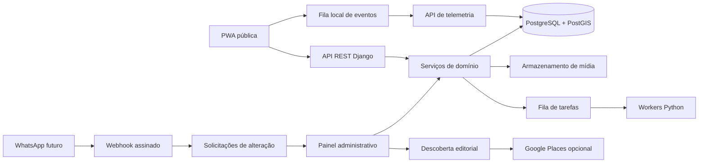
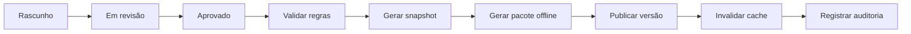
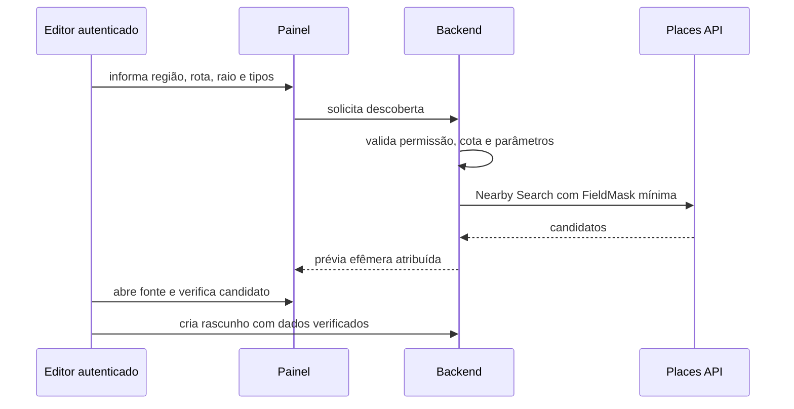
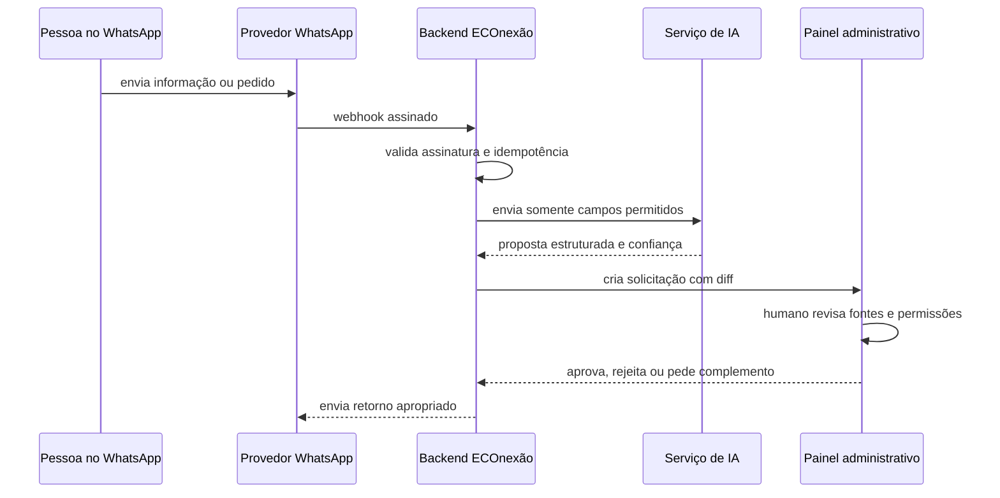

# Arquitetura do backend Python e APIs

> **Status:** direção técnica recomendada e implementável  
> **Estilo:** monólito modular, API REST versionada e publicação por versões

## 1. Objetivos técnicos

- Sustentar múltiplas regiões sem duplicar código.
- Concentrar regras de negócio, permissões e publicação no backend Python.
- Fornecer APIs estáveis para PWA, futuro aplicativo nativo e integrações.
- Permitir edição por painel e carga por CSV.
- Registrar auditoria e governança de conteúdo.
- Receber analytics em lote com minimização e validação.
- Preparar integração futura com WhatsApp e IA sem permitir publicação automática.

## 2. Arquitetura



## 3. Stack recomendada

| Camada | Tecnologia | Motivo |
|---|---|---|
| Frontend público | React + TypeScript com Next.js App Router | PWA, páginas compartilháveis e SEO |
| Mapa | MapLibre GL JS compatível com GeoJSON | evita acoplamento do domínio ao provedor de tiles |
| Linguagem | Python | decisão do projeto |
| Framework | Django | modelos, migrations, autenticação, permissões e admin |
| API | Django REST Framework | contratos REST, serialização e permissões |
| Documentação | OpenAPI 3 com `drf-spectacular` | contrato legível e tipos geráveis |
| Banco | PostgreSQL | integridade relacional e operação madura |
| Geográfico | PostGIS + GeoDjango | pontos, linhas, limites e consultas espaciais |
| Jobs | Celery + Redis | importações, mídia, snapshots e agregações |
| Mídia | armazenamento S3 compatível | separação entre arquivos públicos e privados |
| Cache | Redis e cache HTTP/CDN | leituras públicas e catálogo |
| Testes | pytest + pytest-django | testes de domínio, API e integração |

Celery e Redis podem ser ativados no primeiro momento em que importações ou geração de pacotes excederem uma requisição curta. A interface da tarefa deve existir desde o início, mesmo se a primeira implementação executar pequenos lotes de forma síncrona.

## 4. Organização do código

```text
apps/
  web/                       # PWA pública
  admin/                     # painel operacional
services/
  api/
    config/
    modules/
      accounts/
      regions/
      routes/
      catalog/
      governance/
      publication/
      imports/
      telemetry/
      privacy/
      reports/
      integrations/
      audit/
    tests/
packages/
  contracts/                 # OpenAPI, JSON Schema e tipos
  ui/                        # componentes e tokens compartilhados
  config/                    # configurações compartilhadas
docs/
```

### Módulos

| Módulo | Responsabilidade |
|---|---|
| `accounts` | usuários administrativos, papéis, MFA e sessões |
| `regions` | regiões e informações territoriais |
| `routes` | rotas, etapas, segmentos, preparação e alertas |
| `catalog` | empresas, prestadores, comunidades, instituições, contatos, horários e adaptador de descoberta |
| `governance` | fontes, verificações, consentimentos de conteúdo e direitos de mídia |
| `publication` | validação, versões, snapshots, publicação, suspensão e rollback |
| `imports` | upload, mapeamento, validação, aplicação e reversão de CSV |
| `telemetry` | eventos, esquemas, ingestão, agregação e retenção |
| `privacy` | preferências, provas, solicitações e rotinas de eliminação |
| `reports` | relatos de informação incorreta e SLA |
| `integrations` | WhatsApp, IA e integrações futuras |
| `audit` | trilha append-only de ações críticas |

## 5. Princípios de implementação

1. Views e serializers não concentram regras de negócio.
2. Regras ficam em serviços Python testáveis.
3. O frontend não acessa o banco diretamente.
4. Conteúdo público vem apenas de versões publicadas.
5. Rascunhos e dados privados nunca entram em snapshots públicos.
6. Publicação e importação são idempotentes.
7. Exclusão editorial é arquivamento, salvo obrigação de eliminação de dado pessoal.
8. APIs públicas e administrativas são separadas por permissão.
9. Eventos aceitam apenas propriedades previstas em esquema.
10. Mudanças futuras de IA geram proposta/diff, não atualização direta.

## 6. Rotas da API pública

Prefixo: `/api/v1`

| Método | Endpoint | Finalidade |
|---|---|---|
| `GET` | `/regions` | listar regiões publicadas |
| `GET` | `/regions/{region_slug}` | obter apresentação da região |
| `GET` | `/regions/{region_slug}/routes` | listar rotas publicadas da região |
| `GET` | `/regions/{region_slug}/routes/{route_slug}` | obter visão geral da rota |
| `GET` | `/regions/{region_slug}/routes/{route_slug}/map` | obter GeoJSON, etapas, pins e alertas |
| `GET` | `/regions/{region_slug}/routes/{route_slug}/catalog` | listar catálogo contextual da rota |
| `GET` | `/regions/{region_slug}/routes/{route_slug}/offline-manifest` | obter versão, arquivos e checksums |
| `GET` | `/regions/{region_slug}/routes/{route_slug}/alerts?since={timestamp}` | obter alertas recentes |
| `GET` | `/catalog` | busca pública filtrada por região/categoria |
| `GET` | `/catalog/{actor_slug}` | obter detalhe público do ator |
| `GET` | `/categories` | listar categorias publicadas |
| `GET` | `/search` | busca unificada com limites de privacidade |
| `POST` | `/content-reports` | registrar informação incorreta |
| `POST` | `/events/batch` | receber eventos consentidos |
| `POST` | `/privacy/consents` | registrar ou atualizar preferência |
| `POST` | `/privacy/requests` | solicitar acesso, correção ou exclusão |
| `GET` | `/releases/current?region={slug}` | obter composição publicada atual |

Slugs de rota são únicos dentro de uma região. Endpoints públicos de rota sempre
recebem `region_slug` e `route_slug` para que a resolução seja inequívoca e não
misture dados entre regiões.

### Filtros públicos

- `region`
- `route`
- `category`
- `interest`
- `duration_max`
- `difficulty`
- `accessibility`
- `page`
- `page_size`

Filtros desconhecidos retornam erro de validação; não são silenciosamente ignorados.

## 7. Rotas da API administrativa

Prefixo: `/api/v1/admin`

### Regiões e rotas

| Método | Endpoint |
|---|---|
| `GET, POST` | `/regions` |
| `GET, PATCH` | `/regions/{id}` |
| `GET, POST` | `/routes` |
| `GET, PATCH` | `/routes/{id}` |
| `GET, POST` | `/routes/{id}/stages` |
| `PATCH` | `/routes/{id}/stages/reorder` |
| `GET, POST` | `/routes/{id}/alerts` |
| `GET` | `/routes/{id}/readiness` |
| `POST` | `/routes/{id}/submit-review` |
| `POST` | `/routes/{id}/approve` |
| `POST` | `/routes/{id}/publish` |
| `POST` | `/routes/{id}/suspend` |
| `POST` | `/routes/{id}/rollback` |

### Catálogo

| Método | Endpoint |
|---|---|
| `GET, POST` | `/catalog` |
| `GET, PATCH` | `/catalog/{id}` |
| `POST` | `/catalog/{id}/archive` |
| `POST` | `/catalog/{id}/submit-review` |
| `POST` | `/catalog/{id}/approve` |
| `POST` | `/catalog/{id}/publish` |

### Importação

| Método | Endpoint | Finalidade |
|---|---|---|
| `POST` | `/imports` | enviar arquivo e criar job |
| `GET` | `/imports/{id}` | consultar estado e contagens |
| `GET` | `/imports/{id}/rows` | listar prévia, avisos e erros |
| `POST` | `/imports/{id}/validate` | executar ou repetir validação |
| `POST` | `/imports/{id}/commit` | aplicar registros como rascunhos |
| `POST` | `/imports/{id}/rollback` | desfazer lote permitido |
| `GET` | `/imports/{id}/errors.csv` | baixar linhas rejeitadas |

### Analytics, privacidade e auditoria

| Método | Endpoint |
|---|---|
| `GET` | `/analytics/overview` |
| `GET` | `/analytics/funnel` |
| `GET` | `/analytics/routes` |
| `GET` | `/analytics/catalog` |
| `GET` | `/analytics/campaigns` |
| `GET` | `/privacy/requests` |
| `POST` | `/privacy/requests/{id}/assign` |
| `POST` | `/privacy/requests/{id}/complete` |
| `GET` | `/audit-logs` |

## 8. API de eventos

### `POST /api/v1/events/batch`

Exemplo:

```json
{
  "schema_version": 1,
  "consent_id": "con_01J...",
  "sent_at": "2026-07-27T15:00:00Z",
  "events": [
    {
      "event_id": "018f...",
      "event_name": "route_card_clicked",
      "occurred_at": "2026-07-27T14:59:40Z",
      "anonymous_id": "anon_rotativo",
      "session_id": "sessao_efemera",
      "screen_name": "home",
      "region_id": "regiao_uuid",
      "route_id": "rota_uuid",
      "properties": {
        "card_position": 2,
        "source": "featured"
      }
    }
  ]
}
```

### Regras

- Máximo recomendado: 50 eventos por lote.
- `event_id` é obrigatório e idempotente.
- Eventos com consentimento ausente ou incompatível são rejeitados.
- `properties` usa allowlist por `event_name`.
- Texto livre, telefone, e-mail, latitude e longitude são proibidos.
- Horário do cliente fora da tolerância é preservado para diagnóstico, mas o servidor registra `received_at`.
- Resposta informa aceitos, duplicados e rejeitados.

## 9. Versionamento e respostas

### Contrato

- Prefixo de versão na URL.
- OpenAPI como fonte do contrato.
- Mudança incompatível cria `/v2`.
- Campos novos opcionais podem entrar na mesma versão.
- Enumeração nova exige clientes tolerantes.

### Erro padrão

```json
{
  "error": {
    "code": "validation_error",
    "message": "Não foi possível processar a solicitação.",
    "fields": {
      "latitude": ["Valor fora do intervalo permitido."]
    },
    "request_id": "req_01J..."
  }
}
```

Mensagens públicas não exibem stack trace, SQL, segredo, caminho interno ou dado de outro usuário.

## 10. Cache e publicação

### Conteúdo público

- `ETag` em listas e detalhes.
- Cache curto para ponteiros de versão atual.
- Cache longo para snapshots imutáveis.
- Revalidação depois da publicação.

### Publicação



Se uma etapa falhar, a versão pública anterior continua ativa.

## 11. Autenticação e autorização

### Público

- Leitura pública sem autenticação.
- Escritas públicas com rate limit, validação e proteção contra abuso.
- Identificador anônimo não concede acesso administrativo.

### Administração

- Sessão Django segura ou provedor OIDC aprovado.
- MFA obrigatório para revisor, publicador e administrador.
- Cookies `Secure`, `HttpOnly` e `SameSite`.
- CSRF nas interfaces autenticadas.
- Expiração e revogação de sessões.

### Papéis

| Ação | Editor | Revisor | Publicador | Analista | Administrador |
|---|---:|---:|---:|---:|---:|
| Editar conteúdo | Sim | Sim | Sim | Não | Sim |
| Importar CSV | Sim | Sim | Sim | Não | Sim |
| Aprovar | Não | Sim | Sim | Não | Sim |
| Publicar | Não | Não | Sim | Não | Sim |
| Ver agregados | Limitado | Limitado | Sim | Sim | Sim |
| Gerenciar usuários | Não | Não | Não | Não | Sim |
| Ver auditoria | Não | Sim | Sim | Não | Sim |

## 12. Segurança

- TLS em trânsito e criptografia gerenciada em repouso.
- Segredos fora do repositório.
- CORS restrito aos domínios autorizados.
- Rate limiting em login, relatos, eventos, busca e webhooks.
- Validação de tipo e varredura de anexos.
- URLs assinadas para arquivos privados.
- Logs estruturados com redaction.
- Backup diário e teste de restauração.
- Dependências atualizadas e verificadas.
- Auditoria append-only para publicação, permissões, importações e pedidos LGPD.
- Ambientes separados para desenvolvimento, homologação e produção.
- Chaves de web services externas ficam somente no backend, separadas por ambiente e
  restritas por API e IP quando possível.
- Integrações faturáveis usam cotas, orçamento e alertas; payloads externos não entram em logs.

## 13. Observabilidade

- `request_id`, `job_id`, `import_id` e `publication_id` para correlação.
- Métricas de latência, erro, fila e banco.
- Alertas para falha de publicação, aumento de 5xx, atraso de fila e ingestão anormal.
- Logs operacionais separados de analytics.
- Nenhum payload de relato, contato ou webhook em log comum.

## 14. Descoberta editorial com Google Places

### Limite arquitetural

A Places API (New) é chamada somente pelo backend em uma operação administrativa. Não existe
endpoint público, chamada direta do navegador ou chave `NEXT_PUBLIC_`. A PWA, o MapLibre, as
APIs públicas e os pacotes offline não dependem do provedor.

O fluxo definitivo será:



### Contratos

- O cliente Python no módulo `catalog` isola endpoint, field mask, timeout, parsing e erros.
- A primeira implementação é uma management command de teste técnico; a interface de produto
  depende da autenticação e do fluxo editorial.
- A futura API administrativa exige sessão, CSRF, papel de editor/revisor/administrador,
  rate limit e auditoria sem payload.
- Respostas não usam cache HTTP, Redis, arquivo ou tabela. Place ID é a única referência
  persistível e terá modelo próprio de fonte externa.
- `Actor.external_id` não recebe Place ID automaticamente.
- Exibição sem mapa inclui atribuição `Google Maps`; exibição cartográfica, se necessária,
  usa mapa do Google separado e nunca o MapLibre.
- Falha, indisponibilidade ou cota esgotada retorna erro recuperável e não afeta conteúdo já
  publicado.

### Operação

- Chave exclusiva para server-side, ambiente e Places API (New).
- Restrição por IP quando houver saída estável.
- Limite por requisição de até 20 resultados e `FieldMask` mínima.
- Orçamento, cotas e alertas configurados antes da homologação.
- Termos de Uso, Política de Privacidade e atribuição aprovados antes da interface gráfica.

Detalhes: `spec/08-google-places-curadoria.md`.

## 15. Integração futura com WhatsApp

### Objetivo

Permitir que uma pessoa autorizada proponha cadastro ou alteração pelo WhatsApp, com assistência de IA e revisão no painel.

### Endpoints reservados

| Método | Endpoint | Acesso |
|---|---|---|
| `GET` | `/api/v1/integrations/whatsapp/webhook` | verificação do provedor |
| `POST` | `/api/v1/integrations/whatsapp/webhook` | provedor assinado |
| `POST` | `/api/v1/integrations/whatsapp/outbound` | serviço interno |
| `GET` | `/api/v1/admin/change-requests` | equipe |
| `GET` | `/api/v1/admin/change-requests/{id}` | equipe |
| `POST` | `/api/v1/admin/change-requests/{id}/approve` | revisor |
| `POST` | `/api/v1/admin/change-requests/{id}/reject` | revisor |
| `POST` | `/api/v1/admin/change-requests/{id}/request-info` | editor/revisor |

### Fluxo previsto



### Regras obrigatórias

- Validar assinatura do provedor.
- Deduplicar pelo identificador da mensagem.
- Separar telefone e conversa dos dados editoriais públicos.
- Informar finalidade e canal de privacidade.
- Não enviar dados sensíveis ou desnecessários ao modelo.
- IA produz JSON estruturado, nível de confiança e campos não resolvidos.
- Toda alteração cria diff e fonte.
- Nenhuma resposta da IA publica diretamente.
- O histórico possui retenção específica e não vira analytics.
- Áudio e imagem exigem política própria antes de serem ativados.

## 16. Integração futura com IA

### Tarefas permitidas

- Extrair campos de uma mensagem.
- Sugerir categoria.
- Normalizar endereço e horário.
- Detectar duplicidade provável.
- Produzir resumo e perguntas de esclarecimento.
- Gerar proposta de alteração.

### Tarefas proibidas sem humano

- Publicar ou apagar conteúdo.
- Confirmar segurança, saúde, preço ou horário como fato.
- Inferir consentimento.
- Criar coordenadas como se tivessem sido verificadas.
- Classificar uma parceria como editorial.
- Tomar decisão jurídica ou comercial.

### Contrato interno sugerido

`POST /internal/v1/ai/content-proposals`

Entrada:

- texto minimizado;
- contexto de região/rota;
- esquema de saída;
- finalidade;
- identificador interno de correlação.

Saída:

- campos propostos;
- confiança por campo;
- evidências citadas;
- campos ausentes;
- riscos e necessidade de revisão.

## 17. Critérios de aceite do backend

- Região não está codificada como constante.
- APIs públicas retornam somente versões publicadas.
- OpenAPI é gerado e validado no CI.
- A publicação é atômica e possui rollback.
- Importação repetida com o mesmo identificador não duplica registros.
- Evento repetido com o mesmo `event_id` não duplica contagem.
- Propriedade não permitida em analytics é rejeitada.
- Usuário sem papel recebe `403` em ação administrativa.
- Toda publicação, importação confirmada e mudança de permissão gera auditoria.
- Webhooks futuros possuem ponto de extensão sem acesso direto à publicação.
- Google Places não aparece em contratos públicos, cache, MapLibre ou pacote offline.
- A busca externa não revela chave, não persiste payload e falha sem afetar o núcleo público.
