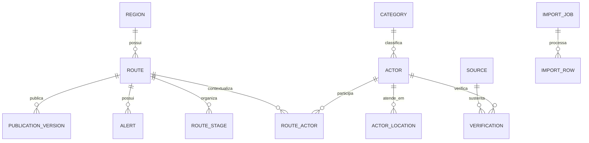
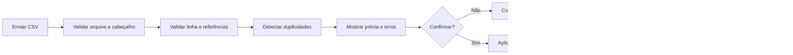

# Modelo de dados e importação CSV

## 1. Princípio de modelagem

A estrutura deve representar uma plataforma multirregional:

Santarém–Alter do Chão, Altamira e Belém serão registros de `Region`, não configurações ou tabelas separadas.

## 2. Entidades principais

### `Region`

Representa uma região turística operacional.

Campos principais:

- `id`
- `slug`
- `public_name`
- `short_description`
- `boundary`
- `center_point`
- `timezone`
- `status`
- `published_version`
- `created_at`
- `updated_at`

### `Route`

Representa uma rota dentro de uma região.

Campos principais:

- `id`
- `region_id`
- `slug`
- `public_name`
- `short_promise`
- `description`
- `duration_minutes`
- `difficulty`
- `estimated_cost_min`
- `estimated_cost_max`
- `transport_modes`
- `preparation_content`
- `accessibility_content`
- `offline_enabled`
- `editorial_status`
- `current_publication_id`

### `RouteStage`

Etapa ordenada de uma rota.

- `id`
- `route_id`
- `position`
- `public_name`
- `description`
- `point`
- `arrival_guidance`
- `duration_minutes`
- `stage_type`
- `is_optional`

### `RouteSegment`

Trecho entre etapas.

- `id`
- `route_id`
- `from_stage_id`
- `to_stage_id`
- `geometry`
- `transport_mode`
- `distance_meters`
- `duration_minutes`
- `instructions`

### `Actor`

Entidade pública exibida no catálogo. Pode ser empresa, prestador individual, comunidade, instituição ou ponto de apoio.

- `id`
- `external_id`
- `actor_kind`
- `category_id`
- `slug`
- `public_name`
- `legal_name`
- `short_description`
- `full_description`
- `services`
- `editorial_status`
- `partnership_type`
- `created_at`
- `updated_at`

`legal_name` é administrativo por padrão. Para prestador individual, nome e contato exigem fundamento e autorização adequados antes da exibição pública.

### `ActorLocation`

Um ator pode ter mais de um endereço ou local de atendimento.

- `id`
- `actor_id`
- `region_id`
- `label`
- `address_fields`
- `point`
- `service_area`
- `is_primary`
- `public_visibility`

### `RouteActor`

Relação contextual entre ator e rota.

- `route_id`
- `actor_id`
- `stage_id` opcional
- `route_role`
- `editorial_position`
- `is_featured`
- `sponsorship_label`

### `ContactChannel`

- `actor_id`
- `channel_type`
- `value_encrypted`
- `public_value`
- `is_public`
- `authorization_reference`
- `verified_at`

O valor público só é preenchido quando sua divulgação estiver autorizada.

### `OperatingHours`

- `actor_location_id`
- `weekday`
- `opens_at`
- `closes_at`
- `is_closed`
- `exception_date`
- `public_note`

O CSV inicial pode importar uma descrição textual; horários estruturados poderão ser revisados no painel.

### `Alert`

- `region_id`
- `route_id`
- `stage_id` opcional
- `severity`
- `title`
- `description`
- `alternative`
- `starts_at`
- `ends_at`
- `status`

### `Source` e `Verification`

Mantêm a rastreabilidade.

`Source`:

- tipo;
- referência;
- organização ou interlocutor;
- data do documento/consulta;
- nível de acesso;
- observações privadas.

`Verification`:

- entidade e campo verificado;
- método;
- estado;
- responsável;
- data;
- validade;
- fonte.

### `MediaAsset`

- arquivo ou URL;
- tipo;
- texto alternativo;
- crédito;
- titular do direito;
- autorização;
- validade;
- visibilidade.

### `PublicationVersion`

- entidade publicada;
- número da versão;
- snapshot;
- checksum;
- autor;
- aprovador;
- motivo;
- data;
- estado.

### `ImportJob` e `ImportRow`

Registram arquivo, hash, autor, mapeamento, prévia, contagens, erros, aplicação e eventual rollback.

### `AnalyticsEvent`

Evento pseudonimizado com esquema fechado. Não aceita texto livre, coordenadas ou contatos.

### `ConsentRecord`

Registra finalidade, versão do aviso, decisão, data, identificador pseudônimo e revogação.

### `ChangeRequest`

Solicitação de alteração vinda do painel, relato, CSV ou futuro WhatsApp/IA.

- origem;
- solicitante;
- payload original protegido;
- proposta estruturada;
- diff;
- confiança;
- estado;
- revisor;
- decisão.

## 3. Classificação de dados

| Classe | Exemplos | Exposição |
|---|---|---|
| Público | nome comercial autorizado, descrição, endereço comercial, telefone público | API e PWA |
| Administrativo | razão social, observações, fonte privada, negociação | painel restrito |
| Pessoal | nome de prestador, telefone pessoal, e-mail, identificador de consentimento | acesso mínimo e finalidade definida |
| Sensível ou de risco elevado | acessibilidade individual, localização precisa, documentos | não coletar no analytics; tratamento específico se necessário |
| Anônimo agregado | totais diários sem possibilidade razoável de reidentificação | dashboard e relatórios |

## 4. CSV do catálogo

O arquivo [catalogo-template.csv](./schemas/catalogo-template.csv) é o modelo inicial.

### Unidade de uma linha

Uma linha representa **um ator do catálogo em sua localização principal**, com vínculo opcional a uma ou mais rotas.

Casos complexos — múltiplos endereços, muitos contatos, horários estruturados ou papéis diferentes por rota — entram pelo painel após a importação ou por formatos normalizados futuros.

### Convenções

- Codificação: UTF-8.
- Separador: vírgula.
- Cabeçalho obrigatório.
- Decimal: ponto.
- Datas: ISO 8601.
- Estado brasileiro: sigla de duas letras.
- País: ISO 3166-1 alfa-2, como `BR`.
- Telefones: E.164, como `+5593999999999`.
- Booleanos: `true` ou `false`.
- Múltiplos valores: barra vertical `|`.
- Coordenadas: WGS84 / SRID 4326.
- Célula com vírgula, aspas ou quebra de linha deve estar entre aspas.
- Arquivo máximo inicial recomendado: 20 MB ou 10.000 linhas.

## 5. Dicionário de colunas

| Coluna | Obrigatória | Formato/regra |
|---|---:|---|
| `external_id` | Sim | identificador estável e único na fonte |
| `action` | Sim | `upsert` ou `archive` |
| `record_status` | Sim | `active` ou `inactive` |
| `publish_status` | Sim | na importação deve ser `draft` ou `review` |
| `region_slug` | Sim | região já cadastrada |
| `route_slugs` | Não | slugs separados por `|` |
| `route_role` | Não | `experience`, `support`, `start`, `stop`, `emergency` ou `service` |
| `actor_kind` | Sim | `business`, `individual_provider`, `community`, `institution` ou `support` |
| `category_slug` | Sim | categoria já cadastrada |
| `subcategory` | Não | texto controlado ou sugestão |
| `public_name` | Sim | nome que será exibido |
| `legal_name` | Não | privado por padrão |
| `short_description` | Sim | recomendado até 180 caracteres |
| `full_description` | Não | texto editorial |
| `services` | Não | valores separados por `|` |
| `street` | Não | logradouro |
| `address_number` | Não | número ou `s/n` |
| `address_extra` | Não | complemento |
| `neighborhood` | Não | bairro/comunidade |
| `city` | Sim | município |
| `state` | Sim | UF |
| `postal_code` | Não | somente dígitos ou formato validável |
| `country_code` | Sim | padrão `BR` |
| `latitude` | Condicional | entre -90 e 90 |
| `longitude` | Condicional | entre -180 e 180 |
| `phone_e164` | Não | telefone autorizado |
| `whatsapp_e164` | Não | WhatsApp autorizado |
| `email` | Não | e-mail autorizado |
| `website_url` | Não | `https://` |
| `instagram_url` | Não | URL completa |
| `opening_hours_text` | Não | resumo público |
| `payment_methods` | Não | valores separados por `|` |
| `accessibility_text` | Não | somente informação verificada |
| `languages` | Não | códigos ou nomes separados por `|` |
| `image_url` | Não | URL segura |
| `image_alt` | Condicional | obrigatório quando houver imagem |
| `image_credit` | Condicional | obrigatório quando houver imagem |
| `source_type` | Sim | `inventory`, `institutional`, `direct`, `field`, `public_web` ou `mock` |
| `source_reference` | Sim | URL, código de documento ou referência |
| `verification_status` | Sim | `unverified`, `documental`, `direct`, `institutional` ou `field` |
| `verified_at` | Condicional | obrigatório se não for `unverified` |
| `verified_by` | Condicional | código interno do responsável |
| `public_contact_authorized` | Sim | `true` ou `false` |
| `media_authorized` | Sim | `true` ou `false` |
| `partnership_type` | Não | `none`, `institutional`, `founding`, `sponsored` |
| `admin_notes` | Não | privado; não entra na API pública |

## 6. Regras de validação

### Erros bloqueantes

- Cabeçalho ausente ou desconhecido em modo estrito.
- `external_id` vazio ou repetido no mesmo arquivo.
- Região inexistente.
- Rota inexistente.
- Categoria inexistente.
- Enumeração inválida.
- Coordenada fora do intervalo.
- Telefone fora do padrão.
- URL insegura ou inválida.
- Imagem sem texto alternativo ou crédito.
- Contato preenchido com `public_contact_authorized=false` e pedido de publicação.
- Fonte ausente.
- Tentativa de importar `published`.

### Avisos

- Possível duplicidade por nome e proximidade.
- Descrição longa.
- Endereço sem coordenada.
- Coordenada fora do limite esperado da região.
- Horário apenas textual.
- Verificação antiga.
- Contato vazio.
- Ator sem vínculo com rota.

## 7. Fluxo de importação

### Estados do job

- `uploaded`
- `validating`
- `invalid`
- `ready`
- `committing`
- `committed`
- `partially_failed`
- `rolled_back`
- `cancelled`

## 8. Idempotência e duplicidade

- A chave primária de integração é `external_id`.
- `external_id` identifica o registro na fonte editorial do lote; não é um identificador
  universal do ator e não deve ser substituído silenciosamente por ID de outro fornecedor.
- Reimportar o mesmo `external_id` executa `upsert`, não cria duplicata.
- O hash do arquivo ajuda a detectar reenvio acidental.
- `archive` inativa o registro e preserva histórico.
- Sem `external_id` válido, a linha é rejeitada.
- Possível duplicidade por nome, categoria e distância exige revisão.

### Referências externas e Google Places

Resultados de descoberta do Google Places não entram no CSV e não são transformados
automaticamente em registros. O payload de busca permanece efêmero. O Place ID, por ser a
exceção permitida de armazenamento, poderá ser ligado futuramente ao ator por uma entidade
separada de referência externa com provedor, identificador, data de consulta e responsável.

Nome, endereço, coordenadas, contatos, horário, fotografia e descrição do Google não são
copiados para as colunas do CSV. Para criar um rascunho, o editor verifica os campos em fonte
autorizada ou independente e usa um `external_id` controlado por essa fonte editorial.

Essa separação permite várias fontes por ator, evita acoplamento do domínio ao Google e mantém
a idempotência da importação. Ver `spec/08-google-places-curadoria.md`.

## 9. Privacidade na importação

- Não importar CPF, RG, data de nascimento ou dado bancário.
- Não importar telefone pessoal sem autorização documentada.
- Não importar observações discriminatórias ou dados sensíveis em texto livre.
- `admin_notes` não pode ser usado como depósito de dados pessoais.
- Arquivo original fica em área privada e segue política de retenção.
- Erros exportados não devem adicionar dados ao arquivo original.
- Acesso ao arquivo é restrito a editor, revisor e administrador.

## 10. Critérios de aceite

- O template abre corretamente em Excel e editores compatíveis.
- Caracteres acentuados permanecem íntegros.
- Arquivo válido produz prévia antes de alterar dados.
- Erros indicam linha, coluna, código e mensagem.
- Nenhuma linha importada é publicada automaticamente.
- Reimportação pelo mesmo `external_id` atualiza o rascunho correto.
- Rollback remove ou restaura somente alterações daquele lote, quando permitido.
- Importação gera auditoria com arquivo, hash, autor, data e contagens.
- Contatos sem autorização não aparecem na API pública.
