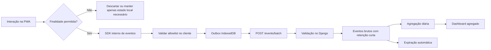

# Plano de analytics, privacidade e LGPD

> **Aviso:** este documento é uma especificação de produto e engenharia. A definição final das bases legais, dos agentes de tratamento, dos contratos e dos prazos deve passar por revisão jurídica antes da produção.

## 1. Objetivos

- Entender como o visitante navega no aplicativo.
- Medir o funil entre descoberta, rota, catálogo e contato.
- Saber quais regiões, rotas, abas, filtros e botões são úteis.
- Identificar falhas de mapa, offline e navegação.
- Ajudar parceiros com indicadores agregados.
- Manter coleta proporcional, transparente e controlável.

## 2. Princípios

1. Sem login não significa ausência de dado pessoal.
2. Analytics de comportamento é separado do funcionamento necessário.
3. Eventos opcionais só saem do aparelho depois da escolha válida.
4. Recusar analytics não reduz o acesso às rotas.
5. Identificadores são aleatórios, pseudônimos e rotativos.
6. IP não integra o conjunto de analytics.
7. Coordenada precisa e trajetória não são coletadas no MVP.
8. Texto livre e dados de contato não entram em eventos.
9. Dashboards trabalham com agregados.
10. Todo evento tem finalidade, proprietário, esquema e retenção.
11. Novo evento exige revisão de privacidade antes de ser liberado.

## 3. Categorias de tratamento

### A. Funcionamento necessário

Exemplos:

- salvar região e preferências no aparelho;
- manter pacote offline;
- aplicar escolha de privacidade;
- prevenir abuso;
- registrar erros técnicos mínimos.

Não usar essa categoria para medir campanhas, montar funis ou acompanhar preferências de navegação.

### B. Analytics de comportamento

Exemplos:

- tela visualizada;
- card clicado;
- aba aberta;
- filtro aplicado;
- pin selecionado;
- ator visualizado;
- contato iniciado.

Direção recomendada: consentimento específico, livre e revogável antes do envio.

### C. Solicitações iniciadas pelo usuário

Exemplos:

- relato de informação incorreta;
- pedido de privacidade;
- contato opcional para retorno.

Cada formulário informa finalidade e separa campo obrigatório de opcional.

### D. Operação administrativa

Exemplos:

- conta da equipe;
- auditoria;
- aprovação;
- importação;
- incidente.

Possui inventário, acessos e retenção próprios; não se mistura com analytics público.

## 4. Matriz preliminar de finalidade

| Tratamento | Finalidade | Dados mínimos | Direção de base legal |
|---|---|---|---|
| Preferências locais | personalizar no aparelho | região, interesses, acessibilidade local | fora do servidor; revisar se houver sincronização |
| Logs técnicos | segurança e estabilidade | horário, rota técnica, status, request ID | validar legítimo interesse/obrigação aplicável |
| Analytics opcional | medir comportamento e melhorar produto | IDs pseudônimos e eventos em allowlist | consentimento recomendado |
| Localização no mapa | mostrar posição no aparelho | coordenada em memória local | permissão do dispositivo; nova análise se houver envio |
| Relato | corrigir informação | contexto, tipo, descrição | validar conforme solicitação e interesse legítimo |
| Contato do relato | retornar ao visitante | e-mail ou telefone opcional | consentimento específico recomendado |
| Conta administrativa | operar o sistema | identificação profissional e autenticação | validar relação contratual/legítimo interesse |
| Webhook WhatsApp futuro | receber solicitação | telefone, mensagem e metadados necessários | avaliação específica antes da ativação |

A escolha por legítimo interesse exige teste documentado de finalidade, necessidade, balanceamento e salvaguardas. Não se aplica automaticamente a todo analytics.

## 5. Arquitetura de coleta



### Regras técnicas

- Endpoint próprio da ECOnexão.
- Sem pixel de publicidade no MVP.
- Sem cookies de terceiros.
- Sem fingerprinting.
- Sem session replay.
- Outbox limpa eventos expirados.
- Consentimento é conferido no cliente e no servidor.
- Falha de analytics nunca bloqueia a navegação.

## 6. Identificadores

### `anonymous_id`

- UUID aleatório.
- Criado somente para analytics consentido.
- Armazenado no dispositivo.
- Rotacionado, inicialmente, a cada 90 dias.
- Substituído imediatamente após revogação.
- Não derivado de hardware, IP, telefone ou e-mail.

### `session_id`

- UUID efêmero.
- Nova sessão após 30 minutos de inatividade.
- Não autentica o usuário.

### `consent_id`

- Referencia a prova da escolha e sua versão.
- Não deve permitir que pessoas do dashboard localizem o histórico individual.

### `privacy_id`

- Identificador mostrado na central de privacidade.
- Associado a um segredo local para provar controle do dispositivo em solicitações.
- Não é usado em dashboards.

## 7. Experiência de consentimento

### Primeira visita

Apresentar:

> Usamos armazenamento necessário para o aplicativo funcionar. Com sua permissão, também coletamos métricas pseudonimizadas para entender quais telas, rotas e recursos são úteis. Você pode recusar ou mudar de ideia a qualquer momento.

Botões com destaque equivalente:

- `Usar apenas necessários`
- `Permitir métricas`
- `Configurar`

### Regras

- Analytics não vem pré-selecionado.
- Fechar o banner não equivale a consentir.
- Recusar é tão simples quanto aceitar.
- A rota continua funcional após recusa.
- Versão do texto, data e escolha são registradas.
- Mudança material de finalidade exige nova escolha.
- Central de privacidade permite revogação.
- Revogar limpa a fila local e impede novos envios.

## 8. Esquema de evento

```text
event_id
event_name
schema_version
occurred_at
received_at
anonymous_id
session_id
consent_id
consent_version
app_version
screen_name
region_id
route_id
actor_id
stage_id
source
campaign_id
device_class
network_class
display_mode
properties
```

Todos os identificadores territoriais apontam para entidades do produto, não para uma pessoa.

## 9. Propriedades proibidas

- Nome.
- E-mail.
- Telefone.
- CPF ou documento.
- Endereço residencial.
- Latitude ou longitude.
- Trajetória.
- Texto de busca completo.
- Texto de relato.
- Mensagem de WhatsApp.
- URL completa com parâmetros livres.
- Identificador de publicidade.
- User-Agent bruto.
- Conteúdo de formulário.
- Dado sensível.

O servidor rejeita propriedades proibidas mesmo que o cliente tente enviá-las.

## 10. Taxonomia de eventos

### Aplicação e navegação

| Evento | Disparo | Propriedades permitidas |
|---|---|---|
| `app_opened` | abertura da PWA | `entry_type` |
| `screen_viewed` | tela pronta | `screen_name`, `referrer_screen` |
| `navigation_clicked` | item principal | `destination`, `element_id` |
| `back_clicked` | retorno explícito | `screen_name`, `destination` |
| `cta_clicked` | chamada geral | `element_id`, `destination`, `source` |
| `region_selector_opened` | abrir seletor | `screen_name` |
| `region_selected` | confirmar região | `region_id`, `selection_source` |
| `interest_selected` | escolher interesse | `interest_id`, `source` |
| `search_submitted` | enviar busca | `query_length_bucket`, `result_count_bucket` |
| `filters_opened` | abrir filtros | `screen_name` |
| `filters_applied` | aplicar | chaves controladas e contagem |
| `filters_cleared` | remover filtros | `screen_name`, `filter_count` |
| `sort_changed` | ordenar | `sort_key` |

### Rotas

| Evento | Disparo | Propriedades permitidas |
|---|---|---|
| `route_card_clicked` | abrir card | `route_id`, `card_position`, `source` |
| `route_viewed` | visão geral pronta | `route_id`, `route_version` |
| `route_tab_selected` | trocar aba | `tab_name` |
| `route_started` | tocar iniciar | `route_id` |
| `route_completed` | concluir fluxo | `completion_method` |
| `stage_opened` | abrir etapa | `stage_id`, `stage_position` |
| `stage_marked_completed` | marcar etapa | `stage_id`, `stage_position` |
| `favorite_toggled` | favorito local | `state` |
| `share_clicked` | compartilhar | `share_method` |
| `alert_viewed` | expandir alerta | `alert_id`, `severity` |
| `sources_opened` | consultar fontes públicas | `route_id`, `source_count_bucket` |
| `support_point_clicked` | abrir apoio destacado | `actor_id`, `category_id` |

### Mapa

| Evento | Disparo | Propriedades permitidas |
|---|---|---|
| `map_opened` | aba pronta | `route_id`, `offline_state` |
| `map_marker_clicked` | pin | `item_type`, `category_id` |
| `map_item_opened` | detalhe vindo do mapa | `item_type`, `category_id` |
| `map_layers_opened` | camadas | nenhuma |
| `map_layer_toggled` | alternar camada | `layer_id`, `state` |
| `map_list_opened` | alternativa em lista | `source` |
| `map_recentered` | centralizar na rota | nenhuma |
| `location_permission_requested` | antes do prompt | `screen_name` |
| `location_permission_result` | resposta | `granted`, `denied` ou `unavailable` |
| `external_navigation_clicked` | abrir navegação | `item_type`, `provider` |

Não enviar posição, distância exata ou direção.

### Catálogo e contatos

| Evento | Disparo | Propriedades permitidas |
|---|---|---|
| `route_catalog_viewed` | aba pronta | `route_id` |
| `catalog_search_submitted` | busca no catálogo | `query_length_bucket`, `result_count_bucket` |
| `catalog_category_selected` | categoria | `category_id` |
| `catalog_filters_opened` | abrir filtros do catálogo | `route_id` |
| `catalog_filters_applied` | aplicar filtros | filtros controlados |
| `catalog_item_clicked` | card | `actor_id`, `category_id`, `card_position` |
| `actor_viewed` | detalhe pronto | `actor_id`, `route_context_id` |
| `actor_contact_clicked` | contato | `actor_id`, `contact_type`, `route_context_id` |
| `route_context_clicked` | voltar à rota | `route_id`, `actor_id` |

O número, endereço de e-mail e URL pessoal não entram no evento.

### Offline

| Evento | Disparo | Propriedades permitidas |
|---|---|---|
| `offline_download_started` | início | `route_id`, `route_version`, `network_class` |
| `offline_download_completed` | sucesso | `size_bucket`, `duration_bucket` |
| `offline_download_failed` | falha | `error_code`, `stage` |
| `offline_update_started` | atualização | `from_version`, `to_version` |
| `offline_download_removed` | remoção | `route_id` |
| `offline_package_opened` | abertura offline | `route_version` |

### Perfil e privacidade

| Evento | Disparo | Propriedades permitidas |
|---|---|---|
| `profile_preferences_opened` | abrir edição | nenhuma |
| `profile_preferences_saved` | salvar | nomes dos grupos alterados, sem valores sensíveis |
| `offline_manager_opened` | abrir gerenciador | nenhuma |
| `privacy_center_opened` | abrir central | `source` |
| `consent_settings_opened` | abrir escolhas | `source` |
| `consent_changed` | alterar | `analytics_state`, `notice_version` |
| `local_data_cleared` | limpar aparelho | grupos eliminados |
| `privacy_request_opened` | iniciar pedido | `request_type` |

Preferências de acessibilidade ou saúde não aparecem como valor de evento.

### Relatos e qualidade

| Evento | Disparo | Propriedades permitidas |
|---|---|---|
| `issue_report_opened` | abrir formulário | `entity_type`, `issue_type` se já escolhido |
| `issue_report_queued` | salvar offline | `entity_type` |
| `issue_report_submitted` | envio aceito | `entity_type`, `issue_type` |
| `feedback_submitted` | avaliação curta | `score`, `context` |
| `app_error` | erro controlado | `error_code`, `screen_name`, `app_version` |

Nenhum texto do relato ou stack trace completo entra em analytics.

## 11. Governança da taxonomia

Cada evento possui cadastro com:

- nome;
- finalidade;
- dono de negócio;
- tela e gatilho;
- propriedades;
- categoria de consentimento;
- prazo;
- dashboard que o consome;
- data de criação;
- versão;
- estado ativo/depreciado.

### Processo de novo evento

1. Produto descreve a pergunta que deseja responder.
2. Analytics verifica se um evento existente responde.
3. Privacidade revisa necessidade e propriedades.
4. Engenharia adiciona esquema e teste.
5. Evento entra em homologação.
6. Evento é liberado junto com versão do app.
7. Dashboard só usa após validação de qualidade.

## 12. Funis e análises

### Funil de descoberta

`home → região → card da rota → visão geral`

### Funil de aprofundamento

`visão geral → preparação/mapa/catálogo → item`

### Funil de conexão

`rota → catálogo → ator → contato`

### Funil offline

`início do download → conclusão → abertura offline`

### Segmentos permitidos

- região;
- rota;
- campanha;
- QR Code;
- tela de origem;
- categoria;
- classe de dispositivo;
- classe de conexão;
- versão do aplicativo.

### Análises fora do MVP

- replay de sessão;
- perfil individual;
- trajetória no mapa;
- publicidade comportamental;
- enriquecimento com bases de terceiros;
- atribuição entre dispositivos.

## 13. Retenção inicial proposta

| Dado | Retenção inicial | Observação |
|---|---:|---|
| Fila local de eventos | até 7 dias | expira sem conexão |
| Eventos brutos consentidos | até 90 dias | revisão jurídica e operacional |
| Agregados diários anônimos | até 24 meses | somente se efetivamente anônimos |
| Logs comuns de aplicação | 14 dias | sem payload pessoal |
| Logs de segurança | 90 dias | acesso restrito; ajustar ao risco |
| Contato de relato | até encerrar retorno + prazo definido | excluir ou anonimizar depois |
| Relato sem contato | conforme ciclo de correção | separar do analytics |
| Prova de consentimento | prazo jurídico a definir | manter apenas o necessário |
| Registro de incidente | ao menos 5 anos quando sujeito ao RCIS | exigência regulatória vigente |

Expiração deve ser automatizada e testada. Backup não pode virar retenção indefinida.

## 14. Direitos do titular

A central e o processo interno devem atender, conforme aplicável:

- informação;
- confirmação de tratamento;
- acesso;
- correção;
- anonimização, bloqueio ou eliminação;
- informação sobre compartilhamentos;
- revogação do consentimento;
- oposição quando cabível;
- portabilidade quando regulamentada e aplicável.

### Fluxo sem conta

1. O aparelho exibe `privacy_id`.
2. O pedido é assinado com segredo local.
3. O backend localiza os dados pseudônimos compatíveis.
4. A equipe valida escopo e executa.
5. O solicitante recebe protocolo e resultado.

Se o visitante perdeu o aparelho ou limpou o segredo, não se deve prometer associação impossível. O canal humano avalia evidências adicionais sem coletar dados excessivos.

## 15. Localização

### MVP

- Solicitar apenas ao tocar `Mostrar minha localização`.
- Explicar a finalidade antes do prompt.
- Processar coordenada no aparelho.
- Não registrar coordenada em analytics.
- Não armazenar trajetória.
- Não executar em segundo plano.
- Permitir uso normal após recusa.

### Mudança futura

Qualquer envio de coordenada ao servidor exige:

- nova finalidade;
- base legal;
- avaliação de necessidade;
- retenção;
- controles de acesso;
- atualização do aviso;
- análise de impacto;
- novos critérios de aceite.

## 16. Segurança e incidentes

- Separar identificadores de analytics de contatos.
- Criptografar dados pessoais em repouso quando aplicável.
- Restringir acesso a eventos brutos.
- Registrar exportações.
- Testar eliminação.
- Redigir plano de resposta.
- Manter inventário de operadores.
- Avaliar risco de cada incidente.

Conforme a Resolução CD/ANPD nº 15/2024, incidentes confirmados com dados pessoais que possam causar risco ou dano relevante devem ser avaliados para comunicação à ANPD e aos titulares. Quando a comunicação for exigida, o prazo indicado pela ANPD é de **três dias úteis**, ressalvado prazo específico previsto em outra legislação. O processo interno deve escalar imediatamente para o responsável jurídico/privacidade, sem esperar o fim desse prazo.

## 17. RIPD e avaliações

Antes da produção:

- criar inventário das operações;
- realizar avaliação específica do analytics;
- documentar teste de legítimo interesse quando essa hipótese for escolhida;
- elaborar ou atualizar RIPD se o tratamento puder gerar alto risco;
- revisar operadores, transferências internacionais e suboperadores;
- revisar WhatsApp e IA separadamente antes de ativá-los.

## 18. Critérios de aceite

- Nenhum evento opcional é enviado antes da escolha.
- Recusa não impede o uso do app.
- Revogação interrompe coleta e limpa a outbox.
- O servidor rejeita propriedade fora da allowlist.
- Coordenadas nunca aparecem no payload de analytics.
- Contato externo é contado sem registrar o contato.
- Dashboard não permite procurar uma pessoa.
- Eventos repetidos não duplicam contagens.
- Retenção elimina eventos expirados automaticamente.
- Pedido do titular gera protocolo e auditoria.
- Política publicada descreve finalidades, categorias, retenção e canal.
- Analytics passa por testes em aceitar, recusar, revogar, offline e reconectar.

## 19. Referências oficiais

- [Lei Geral de Proteção de Dados Pessoais — Lei nº 13.709/2018](https://www.planalto.gov.br/ccivil_03/_ato2015-2018/2018/lei/l13709.htm)
- [ANPD — Guia Orientativo: Cookies e Proteção de Dados Pessoais](https://www.gov.br/anpd/pt-br/centrais-de-conteudo/materiais-educativos-e-publicacoes/guia-orientativo-cookies-e-protecao-de-dados-pessoais.pdf)
- [ANPD — Guia sobre Legítimo Interesse](https://www.gov.br/anpd/pt-br/centrais-de-conteudo/materiais-educativos-e-publicacoes/guia_legitimo_interesse.pdf)
- [ANPD — Direitos dos titulares](https://www.gov.br/anpd/pt-br/assuntos/titular-de-dados-1/direito-dos-titulares)
- [ANPD — Relatório de Impacto à Proteção de Dados Pessoais](https://www.gov.br/anpd/pt-br/canais_atendimento/agente-de-tratamento/relatorio-de-impacto-a-protecao-de-dados-pessoais-ripd)
- [ANPD — Comunicação de Incidente de Segurança](https://www.gov.br/anpd/pt-br/canais_atendimento/agente-de-tratamento/comunicado-de-incidente-de-seguranca-cis)
- [ANPD — Guia de Segurança da Informação para Agentes de Pequeno Porte](https://www.gov.br/anpd/pt-br/assuntos/noticias/anpd-publica-guia-de-seguranca-para-agentes-de-tratamento-de-pequeno-porte)
