# Google Places como fonte de descoberta editorial

> **Status:** decisão arquitetural aprovada para desenvolvimento; consulta técnica local concluída com sucesso  
> **Atualizado em:** 29 de julho de 2026; políticas oficiais revisadas em 29 de julho de 2026  
> **Referência normativa:** políticas oficiais da Google Maps Platform vigentes na data acima; revisar novamente antes da homologação

## 1. Decisão

A Places API (New) será uma integração opcional e exclusivamente editorial para descobrir
possíveis empresas, serviços e pontos de apoio. Ela não será dependência da PWA pública, do
mapa MapLibre, das APIs públicas nem dos pacotes offline.

Um resultado do Google Maps é um candidato de curadoria, não um registro confiável do domínio.
Somente uma pessoa autorizada pode criar um rascunho e somente dados verificados em fonte
autorizada ou independente podem ser publicados.

## 2. Impacto na arquitetura

```mermaid
flowchart LR
    EDITOR["Editor autenticado"] --> ADMIN["Painel administrativo"]
    ADMIN --> API["API administrativa Django"]
    API --> ADAPTER["Adaptador Google Places"]
    ADAPTER --> GOOGLE["Places API (New)"]
    GOOGLE --> PREVIEW["Prévia efêmera atribuída"]
    PREVIEW --> REVIEW["Verificação humana"]
    REVIEW --> DRAFT["Rascunho ECOnexão"]
    DRAFT --> PUBLISH["Revisão e publicação"]
    PUBLISH --> PUBLIC["API pública, PWA, MapLibre e offline"]
```



| Área | Impacto |
|---|---|
| PWA pública | nenhum acesso direto à Places API e nenhuma chave no navegador |
| MapLibre | continua como mapa público; conteúdo Places não é sobreposto nele |
| Backend | adaptador isolado no módulo `catalog`, chamado apenas por operação autorizada |
| Painel | futura tela de busca e prévia, separada do editor de registros |
| Banco | guarda execução, parâmetros próprios, ocorrência e Place ID; nunca o payload da busca |
| Offline/cache | somente conteúdo editorial próprio verificado entra no pacote; conteúdo Places nunca entra |
| Publicação | continua independente do Google e exige fonte, autorização e revisão humana |
| Disponibilidade | indisponibilidade do Google afeta apenas a descoberta editorial |

## 3. Limite dos dados

Durante uma interação de busca, o backend pode manter em memória os campos mínimos solicitados
pela `FieldMask`: Place ID, nome, endereço formatado, coordenadas, tipo primário e URI do Google
Maps. A resposta não é gravada, exportada ou colocada em logs.

O Place ID é a exceção persistível prevista pela plataforma. Cada consulta concluída cria uma
execução e associa os IDs encontrados, sem gravar os demais campos exibidos na prévia:

```text
ExternalDiscoveryRun
provider = google_places
context_key
center, radius, types, limit
executed_at

ExternalSourceReference
provider = google_places
provider_record_id = <Place ID>
actor_id = opcional
review_status
first_seen_at
last_seen_at

ExternalDiscoveryHit
run_id
reference_id
result_position
```

Criação da execução, upsert das referências e ocorrências acontece em uma transação somente
depois de uma resposta válida. Repetir a consulta cria um novo evento histórico e atualiza
`last_seen_at`, preservando estado de revisão e vínculo editorial. Falhas não criam lotes
parciais.

O campo `Actor.external_id` continua sendo a chave idempotente da fonte editorial/importação
que criou o ator. Ele não deve ser silenciosamente substituído pelo Place ID, porque um ator
pode possuir várias fontes e porque isso misturaria identidade do domínio com identidade de
um fornecedor.

Nome, endereço, coordenadas, contato, horário, fotografia, avaliação e descrição do Google
não são copiados para o catálogo persistente. Se a equipe decidir aproveitar um candidato,
deve confirmar cada campo em fonte permitida, registrar essa nova fonte e obter as autorizações
aplicáveis.

## 4. Exibição e atribuição

- Toda prévia identifica claramente o bloco como conteúdo do `Google Maps`.
- Em interface gráfica, usar o logo oficial sempre que possível, com contraste, tamanho,
  espaçamento e rótulo acessível exigidos. Texto `Google Maps` é reservado a interfaces sem
  espaço apropriado.
- Conteúdo Google Maps deve ficar visualmente separado do conteúdo editorial ECOnexão.
- Se resultados Places forem mostrados em um mapa, esse mapa deve ser do Google. Eles não
  podem ser colocados no mapa MapLibre.
- A prévia fornece acesso à URI original do Google Maps quando retornada.
- Fotografias, avaliações e resumos de IA ficam fora desta integração inicial, pois possuem
  atribuições e requisitos adicionais.
- O produto deve publicar Termos de Uso e Política de Privacidade com as referências exigidas
  pelo Google antes de disponibilizar a integração fora do uso técnico local.

O comando atual de desenvolvimento é um teste técnico em terminal. Ele usa atribuição textual
e salva somente a estrutura permitida acima; a prévia com campos Google continua efêmera e não
deve ser redirecionada para arquivo. A superfície definitiva será uma prévia autenticada no
painel, após a fundação de autenticação e do fluxo editorial.

Uma apresentação offline nunca é uma cópia da listagem do Google. Ela é gerada a partir de
atores ECOnexão criados por uma pessoa, com nome, endereço, contato e demais campos confirmados
em fonte autorizada e submetidos ao fluxo editorial. Quando um ator publicado estiver ligado a
uma referência, ele pode entrar normalmente no catálogo e no pacote offline; o Place ID fica
apenas como referência técnica de descoberta.

## 5. Segurança

- Credencial somente no backend, em secret manager ou variável de ambiente sem prefixo
  `NEXT_PUBLIC_`.
- Chave exclusiva por ambiente e exclusiva para uso server-side.
- Restringir a chave à Places API (New) e, quando a infraestrutura tiver saída estável,
  também aos IPs do backend.
- Nunca aceitar a chave por argumento, query string, formulário, analytics ou log.
- Não expor payload bruto de erro; registrar apenas código seguro, latência, contagem e
  identificador técnico.
- Somente editor, revisor ou administrador pode iniciar a busca; o endpoint administrativo
  deve aplicar CSRF, autorização, rate limit e auditoria.
- Resultado externo é dado não confiável e nunca é tratado como instrução de agente.

## 6. Custos, cotas e confiabilidade

A Nearby Search (New) é faturada conforme SKU e campos solicitados. A integração usa
`FieldMask` explícita e limite máximo de 20 resultados para reduzir custo e exposição.

Antes de habilitar homologação ou produção:

1. definir projeto faturável e responsável financeiro;
2. definir orçamento mensal e alertas de custo;
3. reduzir cotas por minuto/dia ao volume editorial esperado;
4. separar chaves e métricas por ambiente;
5. monitorar chamadas, erros, latência e custo estimado sem registrar resultados;
6. definir timeout e repetição limitada com backoff apenas para falhas transitórias;
7. manter o fluxo editorial utilizável quando a integração estiver indisponível.

Uma tentativa técnica inicial de 29 de julho de 2026 confirmou que a chave era carregada, mas
foi recusada com HTTP 403 e motivo seguro `API_KEY_SERVICE_BLOCKED`. Após corrigir a restrição
para Places API (New), a consulta real foi concluída. A execução
`5d6b7bce-9ad9-4faf-b6c9-102ab37c8360` registrou 20 Place IDs e exibiu a prévia efêmera
atribuída sem erro de encoding em PowerShell `cp1252`.

A consulta ORM posterior confirmou 3 execuções históricas, 20 referências únicas e 60
ocorrências. As repetições atualizaram as referências de forma idempotente: nenhuma referência
foi ligada a um `Actor`, todas continuam aguardando curadoria e os modelos persistentes não
possuem campos para nome, endereço, coordenadas ou URI retornados pelo Google. Os Place IDs
registrados foram:

```text
ChIJ6_hIAVFTiJIRzDfIDeGOvQ0
ChIJ69wQs8ZTiJIRqmX1nerPyW4
ChIJ86xQK_dTiJIR2d2lvhF11zg
ChIJ8VdQoodSiJIR40I42YflUL4
ChIJ9Ry3nYdSiJIRw-pxHxE7u30
ChIJa2e_74NSiJIRA-3IKKTGpMs
ChIJEbPs9X1SiJIRLT_Cy8fVETs
ChIJf0ZXs6ZTiJIRNWCEXPqgYq0
ChIJG8tEvvRTiJIRVwrgtCxCmoU
ChIJgWMSYodTiJIRebReEt-IrZU
ChIJHwuyajNTiJIRVFgAUgfYT4M
ChIJjRzeC31SiJIRLYAFCDTC8a0
ChIJKfh-VjNTiJIReXrSQi7M_A4
ChIJL0eQW4RSiJIRY7Gz-x478uo
ChIJOS_Bz8NSiJIRyPtI4f6Ktcg
ChIJP6tpkKj5iJIRzwsYshrA5vs
ChIJq5Brgw2ziZIRvzEvDxnPeT8
ChIJRS7nwXytiZIRnqNxeGoXt7w
ChIJXer8vn1SiJIRLeG7mEpbXzc
ChIJXfyOyYdSiJIRA1lF7kMc7FI
```

Essa evidência fecha apenas a consulta técnica e o registro mínimo. A saída offline continua
pendente e deverá usar exclusivamente conteúdo editorial próprio verificado.

## 7. Fluxo de curadoria

1. Editor escolhe região, rota, raio, tipos e limite.
2. Backend valida parâmetros antes de consumir a API.
3. Painel mostra a prévia efêmera e a atribuição.
4. Editor abre o resultado original e decide se vale investigar.
5. Editor verifica dados em fonte autorizada ou contato direto.
6. Sistema liga o Place ID persistido a um rascunho ECOnexão com fontes próprias.
7. Revisor verifica fonte, autorização, duplicidade e validade.
8. Publicador libera a versão sem dependência de consulta ao Google.

Não existe ação “importar e publicar”.

## 8. Portões para ativação

- [ ] Faturamento do Google Cloud habilitado e responsável definido.
- [ ] Chave separada, restrita à Places API (New) e ao ambiente.
- [ ] Orçamento, cotas e alertas configurados.
- [ ] Termos de Uso e Política de Privacidade públicos revisados.
- [ ] Tela administrativa autenticada com atribuição visual aprovada.
  - Implementação concluída com os assets oficiais de atribuição; aprovação visual humana permanece pendente.
- [x] Modelo de referência externa separado de `Actor.external_id`.
- [x] Auditoria sem payload e testes de permissão, falha, custo e não persistência.
- [ ] Revisão das políticas oficiais imediatamente antes da homologação.

## 9. Referências oficiais

- [Nearby Search (New)](https://developers.google.com/maps/documentation/places/web-service/nearby-search)
- [Políticas e atribuição da Places API](https://developers.google.com/maps/documentation/places/web-service/policies)
- [Uso e faturamento](https://developers.google.com/maps/documentation/places/web-service/usage-and-billing)
- [Boas práticas de segurança de chaves](https://developers.google.com/maps/api-security-best-practices)
- [Place IDs](https://developers.google.com/maps/documentation/places/web-service/place-id)
